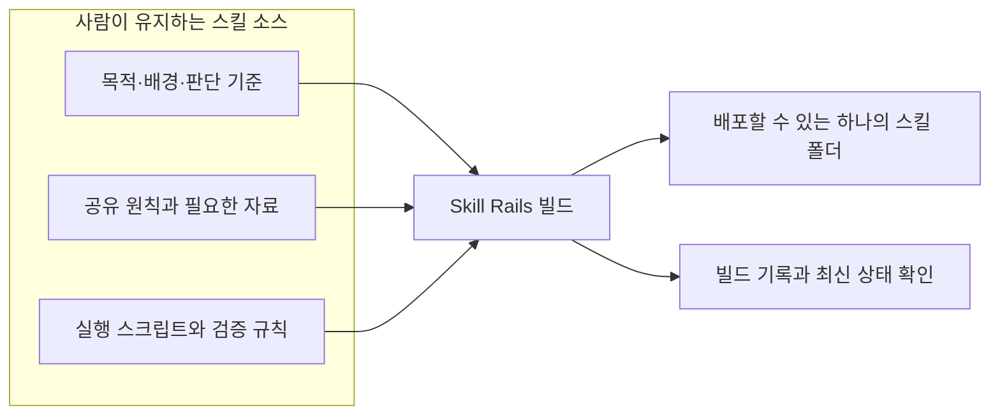

<p align="center">
  
</p>

<br />

<p align="center"><strong>AI 스킬도 소프트웨어처럼 설계하고, 빌드하고, 검증할 수 있습니다.</strong></p>

<p align="center">Skill Rails는 자연어로 작성한 목적과 판단 기준에 실행 스크립트와 검증 구조를 연결해,<br />AI 도구가 발견하고 실행할 수 있는 하나의 스킬 폴더로 빌드합니다.</p>

<p align="center">
  
</p>

<p align="right"><a href="README.md">English</a> · 한국어</p>

## AI 스킬은 작은 문서에서 시작합니다

AI 스킬은 특정한 일을 수행하는 방법을 AI에게 알려주는 지침과 도구의 묶음입니다. 반복해서 설명해야 하는 업무 방식, 판단 기준이나 출력 형식을 스킬로 만들어 두면, AI는 필요할 때 그 내용을 읽고 작업에 적용할 수 있습니다.

처음에는 짧은 `SKILL.md` 하나로 충분합니다. 그러나 스킬을 실제 업무에 사용하기 시작하면 예외, 안전 조건, 실행 순서, 출력 형식과 복구 방법이 계속 더해집니다. 어느 순간 하나의 문서가 목적과 판단 기준뿐 아니라 조건문, 작업 절차, 상태 확인과 오류 대응까지 모두 떠안게 됩니다.

문장이 늘어날수록 AI는 더 많은 내용을 매번 새로 해석해야 합니다. 같은 조건도 문맥에 따라 다르게 읽을 수 있고, 한 문제를 막기 위해 추가한 설명이 다른 규칙과 충돌할 수 있습니다. 누락을 다시 산문으로 보완하는 동안 스킬은 길어지고, 수정할수록 전체를 신뢰하기 어려워지는 순환이 생깁니다.


문제는 자연어 자체가 아닙니다. 사람의 의미 판단과 기계적으로 반복할 수 있는 실행 규칙을 하나의 산문이 모두 맡고 있다는 것이 문제입니다.

## Skill Rails는 스킬을 ‘빌드하는 대상’으로 바꿉니다

일반적인 스킬에서는 사람이 수정하는 원본과 AI 도구의 스킬 경로에 놓이는 결과물이 사실상 같은 문서입니다. 이는 완성된 프로그램을 직접 열어 고치는 것과 비슷합니다. 작은 수정은 쉽지만, 규모가 커질수록 무엇이 원본이고 어떤 결과물이 최신인지 확인하기 어려워집니다.

Skill Rails는 사람이 유지하는 **스킬 소스**와 AI가 사용하는 **빌드 결과물**을 분리합니다.

스킬 소스에는 사람이 자신의 언어로 작성한 목적, 배경, 판단 기준과 예외를 둡니다. 여러 스킬이 함께 사용하는 원칙은 한 곳에서만 관리합니다. 조건, 형식, 입력 상태나 기록 안전처럼 매번 같은 방식으로 처리해야 하는 부분은 Node.js로 실행되는 스크립트와 검증 규칙으로 옮길 수 있습니다.

Skill Rails는 이 소스를 읽어 AI 도구가 사용할 하나의 스킬 폴더를 빌드합니다. 같은 소스로 다시 빌드하면 같은 결과물이 나오고, 배포한 결과가 손상되지 않았는지, 원본이 바뀐 뒤 오래된 상태가 되지는 않았는지 따로 확인할 수 있습니다.



### 빌드하면 실제로 무엇이 생기는가

빌드 결과는 별도의 앱이나 서버가 아니라, 일반적인 AI 스킬 형식을 갖춘 디렉터리입니다. 구성에 따라 일부 폴더는 생략될 수 있지만 대체로 다음과 같은 파일을 가집니다.

```text
my-skill/
├─ SKILL.md                  # AI가 가장 먼저 읽는 진입 문서
├─ references/               # 이 스킬에 포함된 참고 자료
├─ scripts/                  # 실행 로직과 무결성 확인 도구
├─ config/                   # 생성 대상의 선언
└─ .skill-rails-build.json   # 어떤 원본으로 빌드했는지 남기는 기록
```

이 디렉터리를 프로젝트의 `.agents/skills/my-skill/`이나 `.claude/skills/my-skill/` 같은 스킬 경로에 복사하거나 표준 설치 도구로 배치하면, 해당 AI 도구가 `SKILL.md`를 발견하고 안에 포함된 자료와 스크립트를 사용합니다.

따라서 ‘독립적’이라는 말은 별도의 프로그램이 설치된다는 뜻이 아닙니다. **이 스킬 폴더 하나에 실행 중 필요한 내용이 모두 들어 있어, 스킬을 만든 소스 디렉터리나 Skill Rails 자체를 다시 찾지 않아도 된다는 뜻**입니다.

핵심은 프롬프트를 더 길게 써서 AI를 붙잡는 것이 아닙니다. **AI가 판단해야 할 의미는 더 명확하게 쓰고, 매번 같아야 하는 일은 AI가 실행할 수 있는 스크립트로 만드는 것**입니다.

## ‘기계화한다’는 것은 실제로 무엇을 뜻하는가

예를 들어 한 달치 경비 내역과 영수증을 확인해 정산 보고서를 만드는 스킬을 생각해 보겠습니다.

> 모든 경비를 빠짐없이 확인한다. 회사가 정한 금액 이상이면 영수증이 있어야 한다. 날짜·상호·금액이 같으면 중복 후보로 표시한다. 항목별 합계와 전체 금액을 계산하고 일정한 표로 정리한다.

사람은 이 규칙을 쉽게 이해할 수 있습니다. 그러나 자연어 지시는 실행 그 자체가 아닙니다. 항목이 늘고 조건이 겹칠수록 AI가 일부 항목을 건너뛰거나, 같은 조건을 다르게 적용하거나, 계산과 출력 형식을 실수할 가능성도 함께 커집니다.

| 산문으로만 지시하면 | 스크립트로 옮기면 |
| --- | --- |
| “모든 항목을 빠짐없이 확인한다”고 요청합니다. | 반복문이 실제 모든 항목을 순회하고 처리 건수를 확인합니다. |
| 금액과 영수증 조건을 문장으로 나열합니다. | `if` 문이 같은 기준을 모든 항목에 정확히 적용합니다. |
| 중복 판단 기준을 작업할 때마다 다시 설명합니다. | 날짜·상호·금액을 묶은 키로 중복 후보를 찾습니다. |
| 항목별 합계와 반올림을 AI에게 계산하게 합니다. | 함수가 같은 계산법으로 합계와 반올림을 수행합니다. |
| 결과 표의 열과 순서를 산문으로 지정합니다. | 정해진 형식과 검사가 같은 구조의 보고서를 만듭니다. |

업무 목적이 불분명한 경비인지, 예외 사유를 받아들일 수 있는지, 무엇을 사용자에게 다시 물어야 하는지는 여전히 AI와 사람이 판단합니다. 스크립트는 그 판단을 흉내 내지 않고, 반복·조건·계산·형식처럼 확실하게 실행할 수 있는 부분을 맡습니다.

**규칙 10개를 경비 100건에 적용해야 한다면, 산문 방식은 AI가 1,000번의 규칙 적용을 빠뜨리지 않기를 기대합니다. 스크립트는 검증한 규칙 10개를 반복문으로 100건에 실행합니다.**

Skill Rails가 줄이는 것은 설명의 의미가 아닙니다. 매번 다시 해석할 필요가 없는 조건·반복·계산을 프롬프트에서 꺼내 실제로 실행되는 코드로 옮깁니다. 기계적으로 처리할 영역이 커질수록 스킬에 적어야 할 프롬프트의 양도 줄어들 수 있습니다.

AI가 스크립트를 올바른 시점에 호출한다는 전체 행동까지 자동으로 보장되는 것은 아닙니다. 그러나 일단 실행된 조건과 계산은 매번 새롭게 해석되지 않으며, 일반 코드처럼 테스트할 수 있습니다. 오류가 생겼을 때도 산문 전체를 다시 쓰는 대신 잘못된 조건이나 계산을 찾아 고칠 수 있습니다.

## 자신의 언어로 쓰고, AI와 함께 구조화합니다

Skill Rails를 사용하기 위해 처음부터 복잡한 설정 파일을 작성할 필요는 없습니다. 먼저 만들고 싶은 스킬을 평소의 언어로 설명합니다.

- 이 스킬이 없어서 지금 어떤 일을 반복하고 있는가?
- AI가 반드시 이해해야 할 목적과 배경은 무엇인가?
- 사람이나 AI가 상황에 따라 판단해야 하는 부분은 무엇인가?
- 언제나 같은 방식으로 확인하거나 만들어야 하는 부분은 무엇인가?
- 실제로 무엇을 확인해야 완료라고 말할 수 있는가?

AI는 이 답을 바탕으로 스킬 소스를 구성합니다. 모든 작업에서 읽어야 하는 진입 문서, 여러 스킬이 함께 사용하는 원본, 각각 독립적으로 빌드할 생성 대상을 구분합니다. 중요한 의미가 빠져 있다면 그럴듯한 문장으로 메우기보다 미결정으로 남기거나 사용자에게 질문합니다.

```text
my-skill-source/
├─ skill-package.json
├─ modules/
│  └─ shared-policy.md
└─ targets/
   ├─ plan/
   │  ├─ target.json
   │  └─ entry.md
   └─ verify/
      ├─ target.json
      └─ entry.md
```

이 구조는 사용자의 언어를 정해진 문구로 바꾸기 위한 양식이 아닙니다. 사람이 만든 개념과 표현은 원본에 남기고, 그 의미가 어디에 있으며 어떤 스킬이 사용하는지를 분명하게 만드는 방식입니다.

## 하나의 원본에서 여러 독립 스킬을 만듭니다

계획 스킬과 검증 스킬이 같은 정책을 사용한다고 생각해 보겠습니다. 각각의 `SKILL.md`에 정책을 복사하면 처음에는 편하지만, 정책을 바꿀 때 두 문서를 함께 찾아 고쳐야 합니다. 하나를 빠뜨려도 설치와 실행은 가능하기 때문에 오래된 규칙이 조용히 남을 수 있습니다.

Skill Rails에서는 공유 정책을 한 원본에 두고 두 생성 대상이 그 원본을 사용한다고 선언합니다. 빌드할 때는 필요한 내용이 각 스킬에 포함되므로, 계획 스킬과 검증 스킬은 서로 의존하지 않고 독립적으로 설치됩니다.

공유 정책을 바꾸면 기존 결과물은 손상되지 않은 채로 ‘원본보다 오래된 상태’가 됩니다. 어떤 생성 대상이 영향을 받았는지 확인한 뒤 필요한 스킬만 다시 빌드할 수 있습니다.

이 차이는 스킬이 커졌을 때 특히 중요합니다.

- 작성자는 같은 의미를 한 곳에서만 고칩니다.
- 유지보수자는 변경한 원본과 이를 사용하는 스킬을 바로 찾을 수 있습니다.
- 사용하는 AI는 저작 저장소나 Skill Rails의 내부 구현을 알 필요가 없습니다.
- 생성된 각 스킬은 다른 스킬이나 전역 실행 환경 없이 독립적으로 작동합니다.

## Skill Rails를 사용하면 무엇이 달라지는가

| 산문만으로 관리할 때 | Skill Rails를 사용할 때 |
| --- | --- |
| 설치할 `SKILL.md`를 직접 고칩니다. | 사람이 관리하는 소스를 고치고 결과물을 다시 빌드합니다. |
| 분기·반복·공통 처리까지 문장으로 풀어 씁니다. | `if`·반복문·함수로 옮기고 문서에는 사용 조건과 의미를 남깁니다. |
| 같은 규칙을 여러 스킬에 복사합니다. | 공유 원본 하나를 여러 생성 대상이 사용합니다. |
| 변경이 어디까지 영향을 주는지 파일을 열어 추적합니다. | 원본과 사용처의 선언된 관계를 조회합니다. |
| 설치된 스킬이 최신인지 눈으로 비교합니다. | 무결성과 원본 대비 최신 상태를 각각 확인합니다. |
| 빌드 성공을 실제 AI 행동의 성공과 혼동하기 쉽습니다. | 전달 검사와 실제 사용 검증을 서로 다른 증거로 남깁니다. |

작성자는 자신의 문제를 설명하는 데 집중할 수 있고, AI는 그 내용을 권장 구조로 정리하는 일을 도울 수 있습니다. 사용하는 AI에게는 빌드된 스킬만 전달되므로, 스킬을 만든 과정이나 Skill Rails 자체를 다시 이해시킬 필요가 없습니다.

## 필요한 만큼만 기계화합니다

모든 스킬에 스크립트가 필요한 것은 아닙니다. 목적과 판단 기준을 이해한 AI가 파일, 터미널이나 브라우저 같은 도구를 사용해 행동하면 충분한 작업은 자연어 중심으로 만드는 편이 더 좋습니다. Skill Rails는 이 가장 단순한 형태를 기본으로 사용합니다.

하나의 정해진 결과물을 반복해서 기록해야 하고, 입력 변경·동시 수정·정확한 형식·기록 후 재확인이 실제 위험이라면 그 부분만 스크립트로 옮길 수 있습니다. 이 선택적 기록 구조의 실제 이름은 `record-only`입니다.

문서가 길다는 이유만으로 나누거나, 코드로 표현할 수 있다는 이유만으로 기계화하지 않습니다. 실제 작업에서 건너뛸 수 있는 내용만 분리하고, 읽기 절감이 탐색과 재읽기 비용보다 클 때만 별도 원본으로 둡니다.

## 레일이 있어도 목적지가 틀리면 실패합니다

Skill Rails의 레일은 스킬의 목적지를 대신 정하지 않습니다. 잘못된 목적이나 비어 있는 판단 기준을 정확한 구조로 빌드하면, 잘못된 스킬이 더 일관되게 만들어질 뿐입니다.

다음과 같은 경우에는 Skill Rails를 사용해도 실패합니다.

- 목적과 완료 의미를 정하지 않은 채 파일 형식부터 채웁니다.
- 사람이 판단해야 할 예외와 권한을 성급하게 코드로 고정합니다.
- 함께 읽고 판단해야 할 내용을 너무 잘게 나눕니다.
- 빌드된 결과물을 직접 수정해 원본과 설치본을 갈라놓습니다.
- 구조 검사 통과를 실제 AI의 이해와 행동이 검증된 것으로 받아들입니다.
- 불확실성을 없애기 위해 규칙, 상태와 검사를 끝없이 추가합니다.

좋은 사용 방법은 반대입니다. 가장 작은 자연어 스킬로 시작하고, 반복되는 해석 차이나 실제 실행 위험이 드러난 부분만 스크립트로 옮깁니다. 빌드 검사는 결과물이 정확히 전달됐는지를 확인하고, 낯선 AI를 통한 사용 검증은 그 스킬이 실제로 이해되고 작동하는지를 확인합니다.

## 설치하고 시작하기

현재 Skill Rails는 Node.js `24.x`에서 동작합니다. 다음 명령으로 설치합니다.

```bash
npx skills@latest add nanomia-ai/skill-rails
```

이 단계에서 설치되는 것은 새로 만들 스킬이 아니라, 스킬 제작을 도울 `skill-rails`입니다. 이후 이 제작 도구를 사용해 필요한 스킬 소스와 빌드 결과물을 별도로 만듭니다.

설치 과정에서 `skill-rails`와 사용할 AI 도구, 전역 또는 프로젝트 설치 위치를 선택합니다. 설치한 `skill-rails`가 현재 세션에 보이지 않을 때만 AI 도구를 다시 시작합니다.

설치가 끝나면 만들고 싶은 스킬을 자연어로 설명합니다.

아래 예시는 Skill Rails에 내장된 기능이 아니라, 사용자가 평소의 업무를 설명해 새로 만드는 스킬의 한 사례입니다.

```text
Skill Rails를 사용해서 한 달치 경비를 정리하는 스킬을 만들어 줘.

경비 내역과 영수증을 확인해 항목별 상태와 합계를 담은 정산 보고서를 만들어야 해.
업무 목적이 불분명한 항목과 예외 사유를 받아들일지는 자연어 판단으로 남기고,
모든 항목의 반복 확인, 영수증 조건, 중복 탐지, 합계 계산과 결과 형식은 스크립트가 같은 방식으로 처리하게 해 줘.
사람이 관리할 소스와 AI 도구가 사용할 스킬 폴더를 분리해서 빌드하고 검증해 줘.
```

AI는 목적과 경계를 정리하고, 필요한 원본과 생성 대상을 작성한 뒤 스킬을 빌드합니다. 이후에는 빌드 결과물을 직접 고치지 않고 소스를 수정해 다시 빌드합니다.

### 명령을 직접 확인할 때

설치된 `SKILL.md`와 같은 폴더를 `<skill-root>`라고 할 때, 다음 명령으로 현재 사용법을 확인할 수 있습니다.

```bash
node "<skill-root>/scripts/skill-rails-cli/src/core/cli.mjs" --help
```

- `build`는 하나 또는 모든 생성 대상을 빌드합니다.
- `check`는 결과물의 무결성과 원본 대비 최신 상태를 확인합니다.
- `inspect`는 정확한 원본과 이를 사용하는 생성 대상을 찾습니다.
- `overview`는 현재 소스에서 전체 구조를 계산해 사람이 읽을 수 있는 개요로 보여줍니다.

`overview`는 현재 구조를 이해하기 위한 보기이며, 별도로 유지해야 하는 또 하나의 원본 문서가 아닙니다.

## 현재 확인된 범위

Skill Rails는 같은 소스의 반복 가능한 빌드, 결과물의 무결성과 최신 상태 확인, 하나의 공유 원본을 사용하는 여러 생성 대상과 선택적인 재빌드를 실제로 검증했습니다. 설치된 Skill Rails로 여러 스킬을 작성하고 빌드한 뒤, 별도의 Codex와 Claude Code가 생성된 스킬을 사용해 실제 결과물을 만드는 과정도 확인했습니다.

이 결과가 모든 종류의 스킬과 환경에서 같은 비용 절감이나 품질 향상을 보장한다는 뜻은 아닙니다. 구조와 빌드 검사는 정확한 전달을 증명하고, 실제 사용 관찰은 AI의 행동과 결과를 증명합니다. 아직 확인하지 않은 효과는 확인된 것처럼 다루지 않습니다.

## 제품의 경계

Skill Rails는 AI가 사용할 독립적인 스킬을 만들고 유지하기 위한 저작 체계입니다. 여러 저장소의 작업을 대신 지휘하거나 AI의 권한을 통제하는 시스템은 아닙니다.

하나의 소스에는 여러 생성 대상을 둘 수 있지만, 빌드된 각 스킬은 독립적으로 사용할 수 있어야 합니다. 생성된 스킬은 이 저장소, 다른 스킬 또는 전역 Skill Rails 설치에 실행 중 의존하지 않습니다.

## 자세한 문서

- [Skill Rails 사용 절차](skills/skill-rails/SKILL.md)
- [제품 목적과 구조](docs/skill-rails_ko.md)
- [구현과 검증 범위](docs/implementation-verification_ko.md)
- [스킬을 발전시킬 때 사용하는 판단 방법](docs/guide/ai-skill-evolution-method_ko.md)
