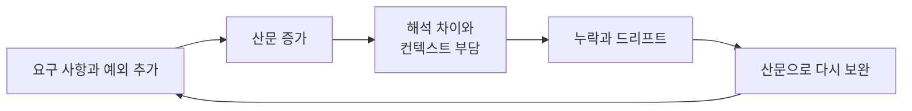
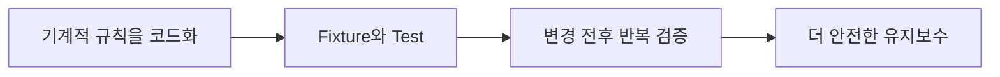
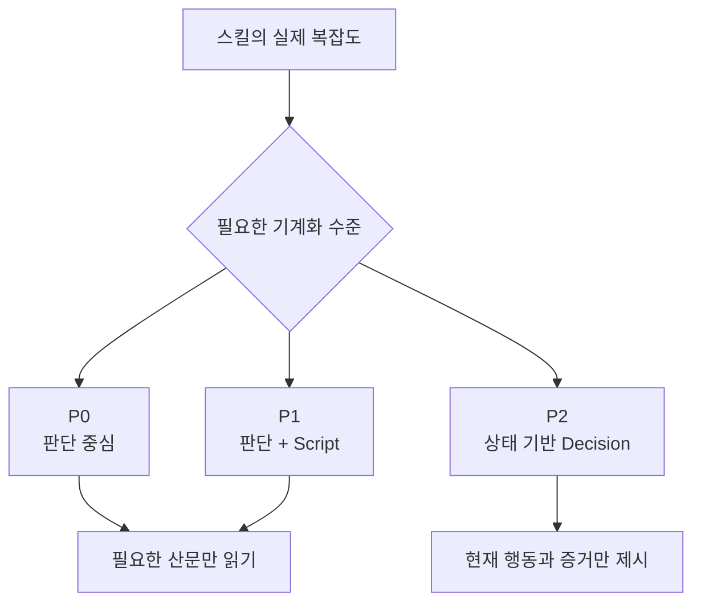
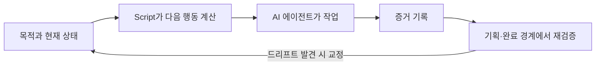
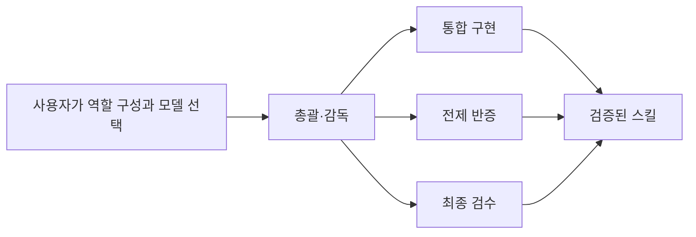

<h1 align="center">SkillRails</h1>

<p align="center"><strong>AI 에이전트를 통한 Skills 개발 과정에서 발생하는 대부분의 문제를 해결합니다.</strong></p>

---

<p align="right"><a href="README.md">English</a> · 한국어</p>

## 스킬 개발 과정에서 발생하는 문제

- 텍스트 기반의 Skills로 복잡한 구조의 동작을 구현하는 것은 지옥과도 같습니다.
- 관점에 따라 다르게 읽히는 산문을 AI 에이전트로 고도화해 나간다는 것은 불결하고 끝없는 산문 재작성의 루프에 빠질 위험이 있습니다.
- 스킬은 시간이 지날수록 요구 사항이 추가되어 내용은 길어지고, 에이전트에게 매번 전체를 읽게 하기에는 부담이 생깁니다.
- 산문으로 작성된 스킬은 정합성을 검증하기 어렵습니다.
- 산문으로 작성된 로직은 AI 에이전트가 드리프트하기 쉬운 대상이며, 의도한 대로 실행된다는 보장이 없습니다.



## 문제 해결 방식

### 1. Skills로 복잡한 로직을 어떻게 구현하는가?

산문 형식의 프롬프트는 길어질수록 AI 에이전트의 드리프트 위험을 높입니다. Skill Rails는 기계적으로 판단할 수 있는 조건, 순서, 형식과 증거 요구를 코드로 옮기고, 생성한 스크립트(script)를 스킬의 실행 도구로 연결합니다. AI가 매번 긴 산문을 새롭게 해석하는 대신 같은 로직을 반복해서 실행할 수 있게 만듭니다.


### 2. 스킬의 구현 과정과 유지보수는 정말 수월해지는가?

- 관점에 따라 다르게 읽힐 수 있는 산문으로 조건문과 실행 로직을 구현하는 것은 극도로 어렵고, 많은 변수를 만들어 결과를 불안정하게 합니다. 기계적인 부분을 코드로 전환하면 일반적인 코딩 방식으로 문제를 분리하고 해결할 수 있어 구현 과정이 정리됩니다.
- 기계적인 처리가 스크립트가 되면 fixture와 테스트를 연결하기 쉬워집니다. 변경 전후의 결과를 반복해서 비교하고, 의도한 규칙이 실제로 유지되는지 확인할 수 있으므로 결과를 더 신뢰할 수 있습니다.



### 3. 스킬의 모든 부분을 코드화할 수 있는가?

- AI 에이전트는 텍스트를 읽고 능동적으로 판단하는 데 필요한 목적, 배경과 기준을 얻습니다. Skill Rails는 그 판단을 대신하는 것이 아니라, 주요 실행 로직을 담은 스크립트를 AI 에이전트가 사용할 도구로 제공합니다.
- 코드로 확정하기 어려운 판단은 산문으로 남깁니다. 서로 다른 상황에서만 필요한 내용은 `SKILL.md`에서 연결되는 트리로 나누어, AI 에이전트가 현재 작업에 필요한 정보만 읽게 합니다.
- Skill Rails는 스킬의 복잡도에 따라 P0부터 P2까지 가장 작은 충분한 프로필을 선택합니다. 이 숫자는 품질이나 엄격함의 등급이 아닙니다. P0는 판단 중심, P1은 판단과 스크립트의 결합, P2는 상태에 따라 다음 행동과 필요한 증거를 계산하는 구조입니다. 더 많은 기계화가 실제로 필요할 때만 다음 프로필을 사용합니다.



### 4. Skill Rails로 스킬을 개발하고 사용하면 어떤 효과가 있는가?

- AI 에이전트가 현재 상황에 필요한 내용만 읽게 하여 컨텍스트 사용을 최적화합니다.
- 기계적으로 확정할 수 있는 주요 실행 로직을 스크립트로 실행하고 테스트하므로, 산문 해석에만 의존하는 것보다 결과를 신뢰할 수 있습니다.
- 작업 중 스크립트가 허용된 행동, 필요한 증거와 다음 단계를 다시 계산하여 드리프트를 기계적으로 교정할 수 있습니다. 기획이 끝나는 시점과 결과를 만들기 전에는 최초 목적과 Skill Rails의 가이드라인을 다시 대조하여, 전체 흐름에서 드리프트하지 않았는지 한 번 더 반증합니다.



이 구조는 AI의 드리프트가 절대로 발생하지 않는다고 보장하지 않습니다. 드리프트하기 어려운 경로를 만들고, 의미 있는 종료 경계에서 이탈을 발견하고 교정할 가능성을 높입니다.

### 5. 이외에 어떤 기능이 있는가?

- 스킬 개발에서 반복적으로 발생하는 문제를 예방하기 위한 가이드라인과 실제 실패 사례에서 얻은 하네스가 포함되어 있습니다. 이 하네스는 예외를 끝없이 추가하는 답안지가 아니라, AI가 목적과 배경을 이해하고 근본적이며 자연스러운 해결에 도달하도록 판단 기준을 제공합니다.
- 역할을 나누어 운영할 필요가 있다면 총괄·감독, 통합 구현, 전제 반증, 최종 검수의 간결한 기본 구성을 사용할 수 있습니다. 역할은 자동으로 강제되거나 에이전트가 스스로 자처하지 않으며, 사용자나 상위 에이전트가 명시적으로 배정한 경우에만 발동합니다. 사용자가 다른 구성이나 모델을 지정하면 그 선택이 우선합니다.
- 오케스트레이션 환경에서는 역할을 별도 에이전트로 분리할 수 있습니다. 별도의 오케스트레이션을 사용할 수 없다면 장시간 구현은 주 작업자가 맡고, 독립적인 반증과 검수처럼 경계가 분명한 작업에 서브 에이전트를 사용할 수 있습니다.
- 다른 에이전트를 호출할 때는 해야 할 일만 넘기지 않습니다. 최초 목적, 배경, 지시의 의도, 유지해야 할 가치와 도달해야 할 방향을 함께 전달하며, 그 에이전트가 다시 하위 에이전트를 사용해도 같은 핵심 맥락이 이어지게 합니다.



## 설치 방법

Node.js 22.20 이상이 설치된 환경에서 다음 명령을 실행합니다.

```bash
npx skills@latest add nanomia-ai/skill-rails
```

설치할 스킬에서 `skill-rails`를 선택하고, 사용할 AI 도구와 전역 또는 프로젝트 설치 위치를 선택합니다. 설치 도구는 선택한 환경에 맞춰 `.claude/skills/` 또는 `.agents/skills/` 아래에 독립적인 Skill Rails 패키지를 설치합니다.

새로 설치한 스킬이 현재 세션에 보이지 않을 때만 AI 도구를 다시 시작합니다.

### 설치 후 바로 사용하기

설치가 끝나면 AI 에이전트에게 자연어로 요청합니다.

```text
Skill Rails를 사용해서 ./skills/release-check에 release-check 스킬을 만들어 줘.
최신 테스트 증거가 없으면 중단하고, 승인이 없으면 질문하며,
증거 없이는 완료했다고 판단하면 안 돼.
```

Skill Rails는 요구 사항을 추적 가능한 obligation으로 정리하고, 필요한 기계화 수준을 선택한 뒤, 스킬 패키지와 검증 구조를 함께 만듭니다.

### 스크립트를 직접 실행하는 경우

대부분의 사용자는 아래 명령을 직접 실행할 필요가 없습니다. 의도 파일로 자동화를 시작하거나 생성 결과를 별도 작업에서 검사할 때만 사용합니다.

의도 파일에서 직접 시작하려면 [intent brief 템플릿](skills/skill-rails/templates/intent-brief.json)을 사용합니다. 아래 `<skill-rails>`는 설치된 경로로 바꿉니다.

```bash
node "<skill-rails>/scripts/init.mjs" --intent ./intent.json --out ./my-skill --profile auto
```

기존 산문 스킬은 원본을 수정하지 않고 포팅할 수 있습니다.

```bash
node "<skill-rails>/scripts/migrate.mjs" --source ./old-skill --out ./ported-skill
```

생성 결과를 검증하고 평가합니다.

```bash
node "<skill-rails>/scripts/lint.mjs" --skill ./my-skill
node "<skill-rails>/scripts/build.mjs" --skill ./my-skill
node "<skill-rails>/scripts/eval.mjs" --skill ./my-skill
```

## 알아둘 제품 경계

Skill Rails는 한 번에 하나의 스킬을 만들고 유지하기 위한 authoring system입니다. 여러 스킬이나 저장소 전체를 오케스트레이션하는 시스템은 아닙니다.

P2 런타임은 현재 상태를 바탕으로 허용된 행동, 필요한 증거와 다음 Decision을 계산하고 검증합니다. 실제 도메인 작업을 대신 실행하거나 호스트 도구의 권한을 통제하지는 않습니다.

## 자세한 문서

- [Skill Rails 사용 절차](skills/skill-rails/SKILL.md)
- [제품 목적과 구조](docs/skill-rails_ko.md)
- [구현과 검증 범위](docs/implementation-verification_ko.md)
- [스킬 작성 과정에서 얻은 교훈](docs/authoring-lessons_ko.md)
