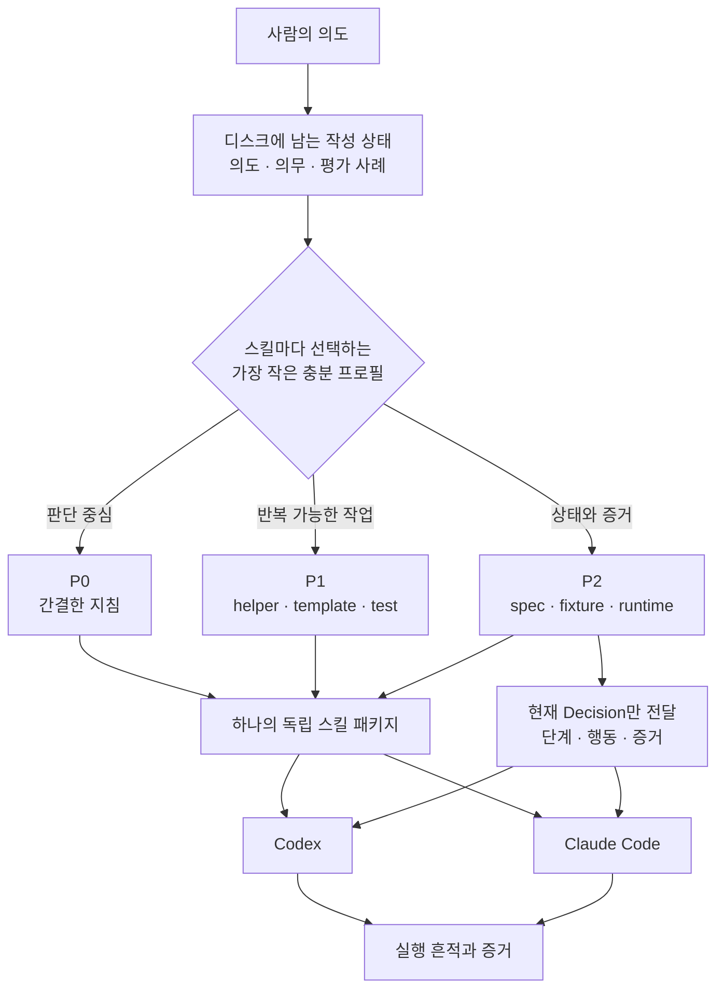

# Skill Rails

[English](README.md) · 한국어

커져도 이해할 수 있고, 고쳐도 쉽게 흔들리지 않는 AI 스킬을 만듭니다.

Skill Rails는 사용자의 의도를 Codex와 Claude Code가 함께 사용할 수 있는 검증 가능한 스킬 패키지로 바꿉니다. 판단은 읽기 쉬운 지침에 남기고, 반복 가능한 규칙은 코드로 옮기며, 상태가 복잡한 스킬은 거대한 산문 대신 현재 필요한 결정만 AI에게 보여줍니다.

## 왜 만들었나

짧은 스킬은 `SKILL.md` 하나로도 충분합니다. 하지만 스킬이 커지면 다른 문제가 생깁니다.

- 실패를 고칠 때마다 설명 문장이 늘어납니다.
- 비슷한 규칙이 여러 곳으로 흩어지고 서로 충돌하기 시작합니다.
- 작성 대화가 길어지면서 초기에 합의한 요구가 빠집니다.
- 스킬을 사용하는 AI는 긴 문서에서 지금 필요한 규칙을 다시 찾아야 합니다.
- 완료했다는 말은 남지만, 실제로 무엇을 확인했는지는 남지 않습니다.

Skill Rails는 이를 문장을 더 잘 쓰는 문제로 보지 않습니다. 스킬을 어떤 구조로 만들고, 무엇을 기계적으로 검증할지의 문제로 다룹니다.



프로필은 플러그인이나 저장소 전체가 아니라 개별 스킬 하나에 붙습니다. 하나의 플러그인 안에 짧은 P0 브레인스토밍 스킬과 상태가 복잡한 P2 구현 스킬을 함께 둘 수 있습니다. Skill Rails가 이들을 서로 체이닝하지는 않습니다.

## 실제로 무엇이 달라지나

### 대화가 끝나도 작성 상태가 남습니다

사용자의 원래 의도, 호출하면 안 되는 유사 사례, 금지 경계, 완료 증거, 아직 해결하지 못한 의무를 디스크에 기록합니다. 다른 AI가 이어받더라도 긴 대화를 추측해서 설계를 복원할 필요가 없습니다.

### 기계적인 규칙에는 소유자가 하나뿐입니다

정확한 변환, 검증, 형식, 반복 검사는 helper와 test가 맡습니다. 상태 분기, 증거 gate, 행동 순서, 종료 조건은 P2의 `spec.mjs`가 맡습니다. 상황에 따라 달라지는 판단과 그 이유만 산문에 남깁니다.

### 스킬을 사용하는 AI는 더 적게 읽습니다

P0는 문서 자체를 짧게 유지합니다. P1은 helper의 소스를 컨텍스트에 넣지 않고 실행 결과를 사용합니다. P2는 runtime이 현재 단계를 계산하고, 지금 필요한 지침·행동·금지사항·증거만 작은 Decision으로 전달합니다.

### 증거가 없으면 성공으로 꾸미지 않습니다

구조 검증, AI의 실제 행동, 최종 결과물의 품질은 서로 다른 주장입니다. 외부 증거가 없는 완료 보고는 `unproven`으로 남습니다.

## 가장 작은 충분 프로필 선택

| 프로필 | 언제 사용하는가 | 무엇이 기계화되는가 | 실행 중 AI가 보는 것 |
| --- | --- | --- | --- |
| **P0** | 짧은 지침과 상황 판단이 핵심일 때 | 의도 구조, 의무 추적, 호출·near-miss 평가 사례 | 짧은 `SKILL.md`와 필요한 reference |
| **P1** | 상태 머신은 필요 없지만 정확한 변환·검증·템플릿·helper가 필요할 때 | P0에 더해 helper, 형식, golden test, 결정적 입력 거부 | 지침과 helper의 실행 결과 |
| **P2** | 상태·승인·증거·행동 순서·비가역 경계에 따라 결과가 달라질 때 | P1에 더해 observation, guard, stage, table, Decision, trace, alignment | 얇은 loader와 현재 Decision. 전체 spec은 읽지 않음 |

문서가 길다는 이유만으로 P2를 선택하지 않습니다. 반복되는 상태 의존 행동이 있을 때 P2가 필요합니다. 하나의 스킬 안에 단순한 경로와 복잡한 경로가 함께 있다면 패키지는 P2가 되지만, runtime은 현재 경로만 AI에게 보여줍니다.

## 빠르게 시작하기

### 필요 환경

- Node.js 20 이상
- Git
- Codex 또는 Claude Code

### 현재 프로젝트의 Codex에 설치

```bash
git clone https://github.com/nanomia-ai/skill-rails.git .agents/skills/skill-rails
npm --prefix .agents/skills/skill-rails ci
```

### 현재 프로젝트의 Claude Code에 설치

```bash
git clone https://github.com/nanomia-ai/skill-rails.git .claude/skills/skill-rails
npm --prefix .claude/skills/skill-rails ci
```

현재 실측으로 검증된 설치 경로는 프로젝트 로컬입니다. 생성된 스킬은 Codex용·Claude용 행동 파일을 따로 관리하지 않고 동일한 패키지를 양쪽에 복사해 사용할 수 있습니다.

### AI에게 스킬 제작 요청

```text
Skill Rails를 사용해서 ./skills/release-check에 release-check 스킬을 만들어 줘.
최신 테스트 증거가 없으면 중단하고, 승인이 없으면 질문하며,
증거 없이는 완료했다고 판단하면 안 돼.
```

AI는 의도를 구조화하고, P0/P1/P2를 선택하고, 평가 사례와 의무 원장을 만든 뒤 패키지를 빌드합니다. 마지막에는 무엇이 검증되었고 무엇이 아직 `unproven`인지 구분해서 보고합니다.

P1과 P2는 일부러 안전하게 실패하는 scaffold에서 시작합니다. marker, 미해결 의무, 실제 도메인 행동과 test를 승인된 내용으로 바꾸기 전까지는 완성된 스킬이 아닙니다.

## 명령어로 직접 사용하기

[`templates/intent-brief.json`](templates/intent-brief.json)을 바탕으로 의도 파일을 만듭니다. 아래 `<skill-rails>`는 Skill Rails가 설치된 경로로 바꾼 다음 실행합니다.

```bash
node "<skill-rails>/scripts/init.mjs" --intent ./intent.json --out ./my-skill --profile auto
```

기존 산문 스킬은 원본을 변경하지 않고 포팅할 수 있습니다.

```bash
node "<skill-rails>/scripts/migrate.mjs" --source ./old-skill --out ./ported-skill
```

생성된 스킬을 검증하고 평가합니다.

```bash
node "<skill-rails>/scripts/lint.mjs" --skill ./my-skill
node "<skill-rails>/scripts/build.mjs" --skill ./my-skill
node "<skill-rails>/scripts/eval.mjs" --skill ./my-skill
```

P2 유지보수는 문장 위치 대신 stable ID를 사용하고 의미상 영향 범위를 보고합니다.

```bash
node "<skill-rails>/scripts/maintain.mjs" --skill ./my-skill --change ./change.json
```

## P2가 실행될 때

```text
얇은 SKILL.md
    ↓
검증된 spec + 현재 observation
    ↓
Decision { status, stage, allowed, forbidden, load, proof }
    ↓
현재 필요한 body와 template만 로드
    ↓
AI 행동 → trace → alignment
```

runtime은 결정을 계산하고 검증하지만 실제 도메인 작업을 대신 실행하지는 않습니다. 도구 호출을 물리적으로 차단하는 sandbox도 아닙니다. Skill Rails는 행동을 감사 가능한 형태로 만들고 증거가 없을 때 안전하게 중단하지만, 도구 권한을 강제하는 책임은 실행 환경에 남습니다.

## 현재 검증 상태

현재 저장소는 다음 검증을 통과합니다.

- creator lint, 전체 테스트, 동결된 평가 gate
- 현재 버전 기준 저장소 테스트 35/35
- Node.js 20·22·24 호환 실행
- Codex와 Claude Code의 fresh project-local 스킬 생성
- Claude가 만든 P1을 Codex에서 사용하고, Codex가 만든 P2를 Claude에서 사용한 교차 실측
- P2 L0–L18, mutation, 반복 scenario, trace, evidence alignment 검증

현재 증거가 뒷받침하는 범위는 Windows의 프로젝트 로컬 설치입니다. 전역 설치, 플러그인 마켓플레이스 배포, Linux/macOS, 넓은 prompt 집합의 trigger 통계, 장기 세션 compaction 복구는 아직 검증 완료로 주장하지 않습니다.

저장소 전체 검증은 다음과 같이 실행합니다.

```bash
npm ci
npm run verify
```

## 지원 범위와 경계

Skill Rails가 하는 일:

- 한 번에 하나의 독립 스킬 생성
- 원래 의도와 provenance가 남는 유지보수 구조 제공
- 결정적 build와 구조 검증
- P2 스킬에 독립 실행 가능한 runtime 포함
- Codex와 Claude Code가 공유하는 portable core 생성

Skill Rails가 하지 않는 일:

- 스킬과 스킬의 자동 체이닝
- 플러그인 전체의 자동 기능 분해와 일괄 프로필링
- 범용 오케스트레이션
- 보안 sandbox 또는 tool-call interception
- 모든 모델이 모든 지침을 따른다는 보장

## 자세한 문서

- [전체 설계·운영·검증 문서](docs/skill-rails_ko.md)
- [작성 절차](references/authoring-workflow.md)
- [P2 계약](references/v5-contract.md)
- [평가 방식](references/evaluation.md)
- [Codex·Claude Code adapter](references/platform-adapters.md)
