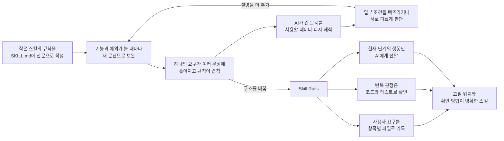

# Skill Rails

[English](README.md) · 한국어

Skill Rails는 복잡한 스킬을 긴 프롬프트로 관리하지 않습니다. 요구는 파일에 항목별로 기록하고, 반복 규칙은 코드와 테스트가 기계적으로 판정하며, AI에는 지금 필요한 지침만 전달합니다.

| 지금 생기는 문제 | Skill Rails가 실제로 하는 일 | 바로 달라지는 점 |
| --- | --- | --- |
| 사용자 요구가 긴 대화와 여러 문단에 흩어집니다. | 요구를 하나씩 기록하고, 각 요구가 반영된 위치와 확인 방법을 연결합니다. | 빠진 요구와 고쳐야 할 위치가 눈에 보입니다. |
| 정확히 반복해야 할 규칙도 AI가 매번 문장으로 다시 해석합니다. | 같은 입력을 코드로 처리하고 테스트로 결과를 확인합니다. | 모델이나 세션이 바뀌어도 같은 규칙을 같은 방식으로 적용합니다. |
| AI가 작업할 때마다 전체 규칙을 다시 읽습니다. | P0/P1은 현재 요청에 맞는 판단 주제로 안내하고, P2는 현재 행동을 계산합니다. | 관련 없는 산문을 컨텍스트에서 제외하고, 긴 대화에서 핵심 규칙이 묻힐 가능성을 줄입니다. |

에이전트 스킬은 보통 `SKILL.md`에서 시작합니다. AI에게 반복해서 수행할 일과 지켜야 할 규칙을 적어두는 문서입니다. 스킬이 짧을 때는 이것만으로도 충분합니다. 문제는 놓친 조건, 새로운 예외, 안전 규칙을 고칠 때마다 문단을 하나씩 덧붙이기 시작하면서 생깁니다.

문서는 길어지지만 행동이 더 정확해지는 것은 아닙니다. 나중에 온 AI가 같은 문장을 다르게 읽을 수 있고, 긴 문서 중간에 묻힌 규칙을 놓칠 수도 있습니다. 대화가 오래 이어지면 처음 합의한 요구가 현재 문맥에서 사라지기도 합니다. 그 실패를 다시 설명 문장으로 보완하면, 다음에는 읽어야 할 문장이 더 많아집니다.

Skill Rails는 여기서 출발합니다. 정말로 판단이 필요한 내용은 짧고 읽기 쉬운 글로 남기고, 같은 입력에 같은 결과를 내야 하는 규칙은 스크립트와 테스트로 옮깁니다. 상태에 따라 다음 행동이 달라지는 복잡한 스킬이라면 그 흐름도 코드가 계산하게 합니다. 결과물은 여전히 하나의 독립된 스킬이지만, 모든 규칙을 거대한 산문 한 덩어리에서 찾을 필요는 없습니다.

## 문제가 커지는 과정과 해결 방식



Skill Rails는 이 악순환을 세 단계로 끊습니다.

### 1. 스킬을 만들기 전에 사용자 요구를 빠짐없이 적습니다

Skill Rails는 먼저 사용자 요청을 `.skill-rails/intent.json`에 항목별로 기록합니다. 예를 들어 “원본 파일은 절대 수정하지 마”라는 조건은 하나의 독립된 항목이 됩니다. `obligation-ledger.json` 추적표에는 이 요구를 반영한 파일이나 코드의 위치와 확인 방법을 연결합니다. 확인 방법은 규칙이 적힌 정확한 파일 구간일 수도 있고, 그 규칙을 실행해 보는 테스트일 수도 있습니다. 구현 위치나 확인 방법이 빠져 있으면 완료된 요구로 처리하지 않습니다. 다른 AI가 작업을 이어받더라도 오래된 대화를 추측하지 않고 이 목록부터 확인할 수 있습니다.

### 2. 반복할 수 있는 규칙은 코드로 옮기고, 판단만 글로 남깁니다

규칙이 실제로 하는 일에 따라 표현 방법을 나눕니다.

| 규칙의 예 | 규칙을 옮기는 곳 | 달라지는 점 |
| --- | --- | --- |
| “출력에는 정확히 세 개의 필드가 있어야 한다.” | 출력 형식을 검사하는 스크립트와 예상 결과 테스트 | 필드 수를 코드가 매번 확인합니다. |
| “승인이 없으면 계속하지 말고 질문한다.” | 승인 여부를 입력받아 `ASK`를 반환하는 P2 조건과 테스트 | AI가 문장을 어떻게 읽느냐와 관계없이 다음 행동이 정해집니다. |
| “이 설명이 독자에게 적절한지 판단한다.” | 짧은 판단 지침 | 계산할 수 없는 판단은 AI에게 남깁니다. |

원칙은 단순합니다. **기계가 안정적으로 확인할 수 있다면 AI가 매번 다시 해석해야 하는 산문으로 남겨두지 않습니다.**

### 3. 실행할 때는 지금 필요한 지침만 AI에게 줍니다

서로 독립적으로 적용되는 판단 주제가 있는 P0/P1 스킬은 진입 문서에서 작은 guidance index를 먼저 엽니다. 각 행은 한 주제가 언제 필요한지와 정확히 어느 파일을 읽을지를 알려줍니다. AI에는 현재 요청에 맞는 주제만 읽고 관련 없는 산문은 파일에 남기도록 지시합니다. 모든 작업에 필요한 경계, 정확한 형식, 중단 규칙은 선택적 라우팅 뒤에 숨기지 않고 진입 문서에 유지합니다.

P2 스킬이 현재 최신 테스트 결과를 기다리는 상태라고 해보겠습니다. 스킬과 함께 생성된 실행 스크립트(runtime)는 상태가 `WAIT`이고, 테스트 실행은 허용되며, 배포는 금지되고, 최신 테스트 결과가 필요하다고 돌려줍니다. 이때 계획 단계나 완료 단계의 규칙까지 AI의 컨텍스트에 넣을 필요는 없습니다. 전체 규칙은 파일에 보관하되, 스킬을 사용하는 AI에는 지금 할 수 있는 일과 아직 필요한 증거만 전달합니다.

## 하나의 예로 보면

배포 가능 여부를 확인하는 스킬이 다음과 같은 산문으로 시작했다고 해보겠습니다.

> 테스트가 있는지 확인한다. 테스트가 오래됐다면 다시 실행한다. 승인 없이 배포하지 않는다. 읽기 전용 환경에서는 파일을 수정하지 않는다. 증거가 있을 때만 완료했다고 보고한다.

처음에는 충분히 명확해 보입니다. 하지만 예외가 늘어나면 다시 질문해야 합니다. 어느 정도가 “오래된” 것인가? 승인은 있지만 읽기 전용인 경우에는 어떤 규칙이 우선하는가? 테스트를 실제로 실행했다는 것은 무엇으로 증명하는가?

Skill Rails를 사용하면 각 문장이 입력, 판정 코드, 테스트로 나뉩니다.

- 원래 요구는 `intent.json`에, 각 요구의 구현 위치와 확인 방법은 `obligation-ledger.json`에 남습니다.
- 테스트 유효기간, 승인 여부, 읽기 전용 여부는 현재 상태를 나타내는 입력값(observation)이 됩니다.
- 조건표는 이 입력값의 조합을 `BLOCK`, `WAIT`, `ASK`, `DONE` 중 하나로 연결합니다.
- 고정된 테스트 입력과 예상 결과(fixture)가 중요한 분기를 하나씩 반복 확인합니다.
- 실행 스크립트(runtime)는 현재 상태에 해당하는 작은 결과만 AI에게 줍니다.
- 실제 실행 기록(trace)을 필요한 증거와 대조하므로 근거 없는 “완료”를 성공으로 인정하지 않습니다.

AI가 실제로 받는 내용은 이 정도로 작을 수 있습니다.

```json
{
  "status": "WAIT",
  "stage": "verification",
  "allowed_actions": ["run-tests"],
  "forbidden_actions": ["release"],
  "proof_required": ["fresh-test-result"]
}
```

나중에 “최신”의 기준이 24시간에서 12시간으로 바뀌면, 유지보수자는 그 기준을 정의한 코드 한 곳을 바꾸고 관련 테스트를 다시 실행합니다. 여러 문단에서 비슷한 표현을 찾아 모두 고쳤는지 추측할 필요가 없습니다.

## P0·P1·P2는 엄격함의 등급이 아닙니다

세 프로필은 규칙을 얼마나 엄격하게 지킬지가 아니라, 어떤 방법으로 지킬지를 구분합니다. 모든 생성 스킬은 사용자 요구를 파일로 남기고, 언제 이 스킬을 사용해야 하는지와 사용하면 안 되는지를 예시로 구분하며, 각 요구가 어디에 반영됐고 무엇으로 확인할지를 추적합니다. 코드로 반복 확인할 규칙이 하나라도 있으면 최소 P1을 선택하고, 현재 상태나 증거에 따라 다음 행동이 달라지면 P2를 선택합니다.

상태 변화가 없는 조언용 스킬에 P2 실행 구조를 추가해도 판단이 더 정확해지지는 않습니다. 관리해야 할 파일과 코드만 늘어납니다. 프로필은 이런 불필요한 복잡성을 피하면서, 실제로 기계화할 수 있는 부분은 빠뜨리지 않기 위한 구분입니다.

| 프로필 | 언제 선택하는가 | 실제로 생기는 것 | 사용하는 AI의 행동 |
| --- | --- | --- | --- |
| **P0 — 구조화된 판단** | 해석, 비평, 조언처럼 상황 판단이 핵심이고 코드로 반복할 변환 규칙이 없을 때 | 사용자 요구 파일, 금지 사항과 경계, 요구별 추적표, 호출·비호출 예시, 그리고 산문에 서로 다른 읽기 조건이 있을 때만 조건부 주제 파일 | 진입 문서와 현재 요청에 맞는 판단 주제만 읽고 판단합니다. |
| **P1 — 실행 가능한 기계 작업** | 정확한 출력 형식, 입력 검사, 반복 변환처럼 매번 같은 결과가 필요한 부분이 있을 때 | P0의 파일에 더해 검사·변환 스크립트, 템플릿, 잘못된 입력의 거부 테스트, 예상 결과 테스트 | 현재 요청에 맞는 판단 주제를 읽고, 정확히 반복해야 하는 작업은 스크립트를 실행합니다. |
| **P2 — 실행 가능한 행동 흐름** | 승인, 증거, 작업 순서나 현재 상태에 따라 다음 행동이 달라질 때 | P1에 필요한 구조와 함께 현재 상태 입력, 단계별 조건표, 다음 행동을 계산하는 실행 스크립트, 실행 기록과 증거 확인 | 현재 상태를 실행 스크립트에 전달하고, 반환된 허용·금지 행동과 필요한 증거를 따릅니다. |

프로필은 플러그인이나 저장소 전체가 아니라 개별 스킬 하나에 붙습니다. 하나의 플러그인 안에 P0 브레인스토밍 스킬, P1 포맷 변환 스킬, P2 구현 워크플로를 함께 둘 수 있습니다. 이들은 각자 독립된 스킬이며 Skill Rails가 서로 체이닝하지 않습니다.

다만 작성 AI가 사용자 요구 자체를 기록하지 않으면 어떤 검사도 그 요구를 되살릴 수는 없습니다. 예를 들어 “원본 파일은 절대 수정하지 마”라는 말을 `.skill-rails/intent.json`에 옮기지 않았다면, 뒤에서 실행되는 검사 코드도 이 조건이 빠졌다는 사실을 알 수 없습니다. 그래서 파일을 만들기 전에 사용자 요청을 한 항목씩 나누고, 각 항목이 반영된 위치와 확인 방법을 추적표에서 대조합니다. 뜻이 불분명한 항목은 임의로 버리지 않고 검토할 항목으로 남깁니다.

## 실제로 만들어지는 구조

파일 수와 실행 구조도 스킬에 필요한 만큼만 생깁니다.

```text
my-skill/
├─ SKILL.md                    # 발견 정보와 짧은 진입 절차
├─ references/                # 필요할 때 작은 index와 조건부 판단 주제를 둠
├─ scripts/ templates/ tests/ # P1 기계 작업이 필요할 때 추가
├─ spec.mjs                   # P2의 상태별 조건과 다음 행동
├─ body.md                    # P2에서 AI의 판단이 필요한 설명
├─ fixtures/                  # P2의 고정 테스트 입력과 예상 결과
├─ scripts/skill-rails/       # P2에서 다음 행동을 계산하는 실행 코드
└─ .skill-rails/
   ├─ intent.json             # 사용자가 원래 요청한 내용
   ├─ obligation-ledger.json  # 각 요구의 구현 위치와 확인 방법
   └─ eval-cases.json         # 호출해야 하는 요청과 비슷하지만 호출하면 안 되는 요청의 평가 사례
```

P1의 처음 생성된 스크립트에는 “아직 구현되지 않음”을 나타내는 표시가 남고, P2에는 작성 AI가 검토해야 할 규칙이 `review-required`와 `DEFERRED` 상태로 남습니다. 작성 AI가 이를 실제 규칙으로 바꾸고 테스트를 통과시키기 전에는 `eval.mjs`가 배포 준비 완료로 판정하지 않습니다. 뼈대만 생성한 뒤 실수로 완성을 선언하는 일을 막기 위한 장치입니다.

## 컨텍스트도 필요한 만큼만 사용합니다

```text
P0  진입 SKILL.md → 선택적 index와 일치하는 주제 → AI가 직접 판단
P1  진입 SKILL.md → 선택적 주제 + 검사·변환 스크립트 → 확인된 결과
P2  진입용 SKILL.md → 다음 행동 계산 스크립트 ───→ 현재 단계의 지침
```

P0/P1 라우팅은 intent에 stable topic ID, 짧은 `when` 조건, 그 주제가 소유하는 판단 항목을 명시했을 때만 생깁니다. 모든 호출에 필요한 판단은 `SKILL.md`에 남습니다. 문서 로딩과 행동 기계화는 서로 다른 결정이므로 profile도 바뀌지 않습니다. Lint는 빠진 index, 끊어진 topic link, index에 없는 topic Markdown, 진입 문서에 복제된 조건부 산문, obligation ledger drift를 거부합니다.

P2의 전체 행동 규칙은 `spec.mjs`에 있습니다. 하지만 스킬을 사용할 때마다 AI가 이 파일 전체를 읽지는 않습니다. 실행 스크립트가 현재 상태에 맞는 단계와 다음 행동을 계산해 작은 JSON 결과(Decision)로 돌려줍니다. 그 결과에는 지금 허용된 행동, 금지된 행동, 읽어야 할 자료, 아직 필요한 증거만 들어 있습니다.

## 설치하고 바로 사용하기

Node.js 22.20 이상이 준비된 프로젝트에서 다음 명령을 실행합니다. 이 버전 요구사항은 현재 `skills` installer가 정한 조건입니다.

```bash
npx skills@latest add nanomia-ai/skill-rails
```

설치 화면에서 `skill-rails`, 사용하는 AI 도구, 현재 프로젝트 또는 전역 범위를 선택합니다. Installer가 같은 Skill Rails 패키지를 Claude Code의 `.claude/skills/`, Codex의 `.agents/skills/`처럼 각 도구가 스킬을 찾는 위치에 배치합니다. 별도의 의존성 설치나 설정은 필요하지 않습니다.

처음 설치하면서 스킬 디렉터리가 새로 생겼고 이미 AI 세션을 열어 둔 상태라면, 설치한 스킬이 보이지 않을 때 그 세션만 한 번 다시 시작합니다. 이는 스킬 목록을 다시 발견하기 위한 것이며 추가 설치 단계가 아닙니다.

이제 설치한 Skill Rails에 평소 말하듯 요청하면 됩니다.

```text
Skill Rails를 사용해서 ./skills/release-check에 release-check 스킬을 만들어 줘.
최신 테스트 증거가 없으면 중단하고, 승인이 없으면 질문하며,
증거 없이는 완료했다고 판단하면 안 돼.
```

작성 AI는 답에 따라 스킬이 해야 할 일, 하지 말아야 할 일, 만들어야 할 결과물이 달라지는 경우에만 추가로 질문합니다. 그 답을 파일에 기록하고, 알맞은 프로필을 선택하고, 실제 규칙과 테스트를 만든 뒤 검증을 실행합니다. 마지막에는 이미 실행해서 확인한 내용과 실제 설치 환경에서 추가로 시험해야 할 내용을 구분해 보고합니다.

## 스크립트를 직접 실행하는 경우

대부분의 사용자는 아래 명령을 직접 실행할 필요가 없습니다. 의도 파일로 자동화를 시작하거나 생성 결과를 별도 작업에서 검사할 때만 사용합니다.

의도 파일에서 직접 시작하려면 [`templates/intent-brief.json`](templates/intent-brief.json)을 사용합니다. 아래 `<skill-rails>`는 설치된 경로로 바꿉니다.

```bash
node "<skill-rails>/scripts/init.mjs" --intent ./intent.json --out ./my-skill --profile auto
```

기존 산문 스킬은 원본을 수정하지 않고 포팅할 수 있습니다.

```bash
node "<skill-rails>/scripts/migrate.mjs" --source ./old-skill --out ./ported-skill
```

생성 결과를 검증하고 평가합니다.

```bash
node "<skill-rails>/scripts/lint.mjs" --skill ./my-skill
node "<skill-rails>/scripts/build.mjs" --skill ./my-skill
node "<skill-rails>/scripts/eval.mjs" --skill ./my-skill
```

## 지금까지 검증한 범위

`b277a4c` v0.1.2 릴리스 기준선의 기록된 환경은 코드 형식 검사와 전체 테스트 49/49를 통과했습니다. 여기에는 외부 runtime dependency를 차단한 상태에서 일반 creator 명령과 parser-backed migration을 실행한 검사도 포함됩니다. 미리 고정해 둔 정상 사례는 통과시키고, 일부러 결함을 심은 사례는 모두 실패로 찾아내는지도 확인했습니다. 앞서 진행한 Node.js 20·22·24 호환성 검사에서는 당시의 35개 테스트가 각 버전에서 모두 통과했습니다. 새 프로젝트에서 시작한 에이전트 세션으로 P1과 P2 스킬을 각각 만든 뒤, 검증된 두 설치 방식에서 같은 생성 결과를 사용했습니다. P2는 필수 파일과 참조 관계 검사(L0–L18), 일부 규칙을 고의로 망가뜨렸을 때 실패하는지 확인하는 테스트, 상태별 반복 실행, 실행 기록과 증거 대조도 통과했습니다. 별도의 fresh author와 consumer 한 쌍은 P0의 다섯 조건부 주제 중 현재 요청과 일치하는 한 주제만 읽었지만, 다중 일치·no-match·near-miss와 큰 index의 routing recall은 아직 검증하지 않았습니다.

이 결과가 뒷받침하는 범위는 Windows의 프로젝트 로컬 실행입니다. GitHub 원격 package도 `skills` 1.5.23으로 Codex, Claude Code, Cursor target에 설치했고, node_modules가 없는 설치본의 migration이 예상한 12개 semantic atom kind를 보존했으며 생성 P2가 L0–L18을 통과했습니다. 이는 발견·복사·설치 명령 실행 증거이지 모든 대상 host의 fresh-agent 행동 증거는 아닙니다. Marketplace 배포, Linux/macOS, 다양한 사용자 요청에서 스킬이 정확히 호출되는지, 긴 대화가 실제로 압축된 뒤에도 규칙을 빠짐없이 복구하는지는 아직 검증하지 않았습니다.

저장소 검증은 다음과 같이 실행합니다.

```bash
npm ci
npm run verify
```

## 제품의 경계

Skill Rails는 한 번에 하나의 독립 스킬을 만들고 유지보수합니다. 플러그인 전체를 자동으로 여러 스킬로 나누거나, 한 스킬이 끝난 뒤 다른 스킬을 자동 호출하거나, 여러 스킬의 실행 순서까지 관리하는 시스템으로 기존 에이전트를 대체하지 않습니다.

P2 실행 스크립트는 다음 행동을 계산하고 필요한 증거가 있는지 확인하지만, 그 행동을 직접 수행하지는 않습니다. 예를 들어 `run-tests`가 허용됐다고 알려줄 수는 있어도 테스트 명령을 실행하는 주체는 AI입니다. 또한 보안 장치가 아니므로 금지된 도구 호출을 물리적으로 차단하지는 못합니다. 근거 없는 완료를 `unproven`으로 표시할 수는 있지만, 실제 도구 권한은 실행 플랫폼이 통제해야 합니다.

## 자세한 문서

- [제품 목적과 설계 경계](docs/skill-rails_ko.md)
- [구현 범위와 검증 기록](docs/implementation-verification_ko.md)
- [작성 절차](references/authoring-workflow.md)
- [P2 계약](references/p2-contract.md)
- [평가 방식](references/evaluation.md)
