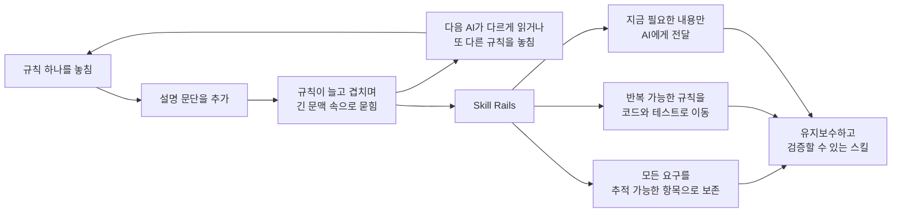

# Skill Rails

[English](README.md) · 한국어

계속 늘어나는 지시문을, AI가 유지보수하고 끝까지 따라갈 수 있는 스킬로 바꿉니다.

에이전트 스킬은 보통 `SKILL.md`에서 시작합니다. AI에게 반복해서 수행할 일과 지켜야 할 규칙을 적어두는 문서입니다. 스킬이 짧을 때는 이것만으로도 충분합니다. 문제는 놓친 조건, 새로운 예외, 안전 규칙을 고칠 때마다 문단을 하나씩 덧붙이기 시작하면서 생깁니다.

문서는 길어지지만 행동이 더 정확해지는 것은 아닙니다. 나중에 온 AI가 같은 문장을 다르게 읽을 수 있고, 긴 문서 중간에 묻힌 규칙을 놓칠 수도 있습니다. 대화가 오래 이어지면 처음 합의한 요구가 현재 문맥에서 사라지기도 합니다. 그 실패를 다시 설명 문장으로 보완하면, 다음에는 읽어야 할 문장이 더 많아집니다.

Skill Rails는 여기서 출발합니다. 정말로 판단이 필요한 내용은 짧고 읽기 쉬운 글로 남기되, 같은 입력에서 반복할 수 있거나 기계적으로 확인할 수 있는 규칙은 스크립트·테스트·실행 가능한 행동 명세로 옮깁니다. 결과물은 여전히 하나의 독립된 스킬이지만, 더 이상 모든 의미가 거대한 산문 한 덩어리에 섞여 있지 않습니다.

## 문제가 커지는 과정과 해결 방식



Skill Rails는 이 악순환을 세 단계로 끊습니다.

### 1. 설계를 대화 밖에 남깁니다

파일을 만들기 전에 원래 해결하려던 문제, 사용 사례, 호출되면 안 되는 유사 요청, 입력과 출력, 안전 경계, 완료 증거를 기록합니다. 각각의 요구는 의무 원장에 추적 가능한 항목으로 남습니다. 이 요구는 어느 파일과 규칙에 반영됐는가? 어떤 테스트나 평가가 그것을 확인하는가? 이 연결까지 함께 보관합니다.

다른 AI가 작업을 이어받을 때 이 차이가 크게 드러납니다. 이전 대화를 추측해서 설계를 복원하는 대신, 디스크에 남은 원래 의도와 아직 해결되지 않은 항목부터 확인할 수 있습니다.

### 2. 규칙마다 알맞은 자리를 정합니다

각 규칙을 볼 때는 세 가지 질문을 던집니다.

| 질문 | 규칙이 들어갈 곳 | 그렇게 하는 이유 |
| --- | --- | --- |
| 같은 입력이라면 언제나 같은 방식으로 확인하거나 변환할 수 있는가? | helper, validator, template, test | AI가 매번 문장을 해석하지 않고 실행하면 됩니다. |
| 현재 상태, 승인, 순서, 증거에 따라 다음 행동이 달라지는가? | P2 행동 명세와 runtime | 긴 설명에서 분기를 다시 찾지 않고 현재 경로를 계산할 수 있습니다. |
| 상황의 의미, 절충, 사람의 판단이 필요한가? | 짧고 주소가 있는 산문 section | 판단까지 억지로 기계화하면 틀린 결론을 자신 있게 내릴 수 있습니다. |

핵심 원칙은 간단합니다. **정직하게 기계화할 수 있는 것은 끝까지 기계화하고, 실제 판단만 산문에 남깁니다.**

### 3. 스킬을 사용하는 AI에게는 현재 화면만 보여줍니다

원래 의도, 전체 테스트, 모든 행동 규칙은 유지보수를 위해 남아 있습니다. 그렇다고 평소 실행할 때 그 모든 내용을 AI의 컨텍스트에 넣지는 않습니다. 단순한 스킬은 문서 자체를 짧게 유지하고, 정확한 작업은 helper를 실행하며, 상태가 복잡한 스킬은 runtime이 현재 결정을 계산합니다. AI는 그 순간 필요한 지침과 출력 형식만 읽습니다.

## 하나의 예로 보면

배포 가능 여부를 확인하는 스킬이 다음과 같은 산문으로 시작했다고 해보겠습니다.

> 테스트가 있는지 확인한다. 테스트가 오래됐다면 다시 실행한다. 승인 없이 배포하지 않는다. 읽기 전용 환경에서는 파일을 수정하지 않는다. 증거가 있을 때만 완료했다고 보고한다.

처음에는 충분히 명확해 보입니다. 하지만 예외가 늘어나면 다시 질문해야 합니다. 어느 정도가 “오래된” 것인가? 승인은 있지만 읽기 전용인 경우에는 어떤 규칙이 우선하는가? 테스트를 실제로 실행했다는 것은 무엇으로 증명하는가?

Skill Rails를 사용하면 같은 의도가 서로 확인 가능한 부분으로 나뉩니다.

- 원래 요구는 intent와 의무 원장에 그대로 남습니다.
- 테스트 유효기간, 승인, 읽기 전용 상태는 이름이 붙은 사실 입력인 observation이 됩니다.
- P2 table은 그 조합을 `BLOCK`, `WAIT`, `ASK`, `DONE` 중 하나로 연결합니다.
- 미리 정한 시험 사례인 fixture가 중요한 분기를 하나씩 반복 실행합니다.
- runtime은 현재 상태에 해당하는 작은 결과만 AI에게 줍니다.
- 실행 기록인 trace를 필요한 증거와 대조하기 때문에 근거 없는 “완료”가 성공으로 바뀌지 않습니다.

AI가 실제로 받는 내용은 이 정도로 작을 수 있습니다.

```json
{
  "status": "WAIT",
  "stage": "verification",
  "allowed_actions": ["run-tests"],
  "forbidden_actions": ["release"],
  "proof_required": ["fresh-test-result"]
}
```

나중에 “최신”의 기준이 24시간에서 12시간으로 바뀌면, 유지보수자는 안정적인 주소를 가진 규칙 하나를 바꾸고 영향을 받는 fixture를 다시 실행합니다. 여러 문단에서 비슷한 표현을 찾아 모두 고쳤는지 추측할 필요가 없습니다.

## P0·P1·P2는 기계화를 줄이는 등급이 아닙니다

프로필이 낮다고 해서 기계적으로 확인할 수 있는 규칙을 산문에 남겨도 된다는 뜻은 아닙니다. 모든 생성 스킬은 구조화된 의도, 호출 사례와 near-miss, 의무 원장, 평가 표면에서 시작합니다. 반복 가능한 규칙이 발견되면 그 스킬은 최소 P1이 되고, 상태나 증거에 따라 행동이 달라지면 P2가 됩니다.

프로필의 목적은 엄격함을 낮추는 것이 아닙니다. 행동을 더 정확하게 만들지도 못하는 상태 머신을 단순한 스킬에 억지로 넣지 않기 위한 것입니다.

| 프로필 | 어떤 스킬인가 | Skill Rails가 더하는 것 | 사용하는 AI의 행동 |
| --- | --- | --- | --- |
| **P0 — 구조화된 판단** | 해석, 비평, 조언처럼 상황 판단이 핵심이고 정확히 실행할 변환 규칙은 없습니다. | 원래 의도, 명시된 경계, 추적 가능한 요구, 호출·near-miss 사례, 새 AI로 확인할 시험 사례를 남깁니다. | 짧은 지침을 읽고 판단합니다. |
| **P1 — 실행 가능한 기계 작업** | 일부 작업에 정확한 형식, 검증 규칙, 반복 변환이 있습니다. | P0와 같은 작성 기록에 더해 helper, template, 입력 거부 규칙, 예상 출력 비교 test를 만듭니다. | 판단은 직접 하되 정확한 작업은 코드에 맡깁니다. |
| **P2 — 실행 가능한 행동 흐름** | 상태, 승인, 증거, 행동 순서, 비가역 경계에 따라 다음 행동이 달라집니다. | 같은 작성 기록과 필요한 기계 작업에 더해 이름이 붙은 사실, 진입 조건, 단계, 조건별 결과표, 반복 시험 사례, 실행 기록, 증거 대조를 만듭니다. | 긴 규칙 전체를 다시 읽지 않고 runtime이 계산한 현재 Decision을 따릅니다. |

프로필은 플러그인이나 저장소 전체가 아니라 개별 스킬 하나에 붙습니다. 하나의 플러그인 안에 P0 브레인스토밍 스킬, P1 포맷 변환 스킬, P2 구현 워크플로를 함께 둘 수 있습니다. 이들은 각자 독립된 스킬이며 Skill Rails가 서로 체이닝하지 않습니다.

작성 AI가 기록하지 않은 요구까지 Skill Rails가 저절로 기계화할 수는 없습니다. 그래서 처음부터 요청을 추적 가능한 의무로 나누며, 해석이 모호한 항목은 낮은 프로필로 조용히 넘기지 않고 검토 대상으로 남깁니다.

## 실제로 만들어지는 구조

파일 수와 실행 구조도 스킬에 필요한 만큼만 생깁니다.

```text
my-skill/
├─ SKILL.md                    # 발견 정보와 짧은 진입 절차
├─ references/                # 판단과 지식. 필요할 때만 읽음
├─ scripts/ templates/ tests/ # P1 기계 작업이 필요할 때 추가
├─ spec.mjs body.md fixtures/ # P2 행동 흐름이 필요할 때 추가
├─ scripts/skill-rails/       # P2에 포함되는 독립 runtime
└─ .skill-rails/
   ├─ intent.json             # 사용자가 원래 요청한 내용
   ├─ obligation-ledger.json  # 각 요구가 어디에 반영됐는지
   └─ eval-cases.json         # 정상 호출과 near-miss 평가 사례
```

P1과 P2는 안전하게 실패하는 scaffold에서 시작합니다. 작성 AI가 일반 marker를 실제 도메인 규칙으로 바꾸고 test로 증명하기 전까지는 완성된 스킬로 취급하지 않습니다.

## 컨텍스트도 필요한 만큼만 사용합니다

```text
P0  짧은 SKILL.md ────────────────────────────────→ AI의 판단
P1  짧은 SKILL.md → 결정적 helper ───────────────→ 정확한 결과
P2  얇은 SKILL.md → runtime → 현재 Decision ─────→ 현재 지침만 사용
```

P2의 행동 정본은 `spec.mjs`이지만, 평소 사용하는 AI가 파일 전체를 읽을 필요는 없습니다. runtime이 spec을 검증하고 현재 stage를 계산한 뒤 작은 Decision을 돌려줍니다. 그 안에는 현재 상태, 허용·금지 행동, 지금 읽을 자료, 아직 필요한 증거가 들어 있습니다.

## 현재 지원하는 플랫폼

스킬을 작성하고 검증하는 핵심 구조는 특정 에이전트 제품에 고정되어 있지 않습니다. 여기서 adapter는 에이전트마다 다른 스킬 설치 위치, 설치된 경로를 찾는 방법, 필요한 메타데이터만 연결하는 얇은 층입니다. 행동 규칙은 adapter가 소유하지 않으므로, 이후 다른 플랫폼을 지원할 때 같은 규칙을 플랫폼별로 다시 작성하지 않는 것이 설계 목표입니다.

현재 구현과 실측을 마친 adapter는 다음 두 가지입니다.

- **Codex:** `.agents/skills`의 프로젝트 로컬 스킬 발견
- **Claude Code:** `.claude/skills`의 프로젝트 로컬 스킬 발견

양쪽에서 서로 다른 행동 파일을 관리하지 않고 동일한 생성 패키지를 사용했습니다.

### 현재 Codex adapter 설치

```bash
git clone https://github.com/nanomia-ai/skill-rails.git .agents/skills/skill-rails
npm --prefix .agents/skills/skill-rails ci
```

### 현재 Claude Code adapter 설치

```bash
git clone https://github.com/nanomia-ai/skill-rails.git .claude/skills/skill-rails
npm --prefix .claude/skills/skill-rails ci
```

Node.js 20 이상과 Git이 필요합니다. 현재 증거로 검증된 설치 경로는 Windows의 프로젝트 로컬 설치입니다.

## 첫 스킬 만들기

설치한 Skill Rails에 평소 말하듯 요청하면 됩니다.

```text
Skill Rails를 사용해서 ./skills/release-check에 release-check 스킬을 만들어 줘.
최신 테스트 증거가 없으면 중단하고, 승인이 없으면 질문하며,
증거 없이는 완료했다고 판단하면 안 돼.
```

작성 AI는 제품 경계를 바꾸는 결정만 확인한 다음 답을 디스크에 기록하고, 프로필을 선택하고, 실제 행동을 구현하고, 검증을 실행해야 합니다. 마지막 보고에서는 확인된 사실과 아직 forward test가 필요한 부분을 구분합니다.

의도 파일에서 직접 시작하려면 [`templates/intent-brief.json`](templates/intent-brief.json)을 사용합니다. 아래 `<skill-rails>`는 설치된 경로로 바꿉니다.

```bash
node "<skill-rails>/scripts/init.mjs" --intent ./intent.json --out ./my-skill --profile auto
```

기존 산문 스킬은 원본을 수정하지 않고 포팅할 수 있습니다.

```bash
node "<skill-rails>/scripts/migrate.mjs" --source ./old-skill --out ./ported-skill
```

생성 결과를 검증하고 평가합니다.

```bash
node "<skill-rails>/scripts/lint.mjs" --skill ./my-skill
node "<skill-rails>/scripts/build.mjs" --skill ./my-skill
node "<skill-rails>/scripts/eval.mjs" --skill ./my-skill
```

## 지금까지 검증한 범위

현재 저장소는 lint, 전체 테스트 35/35, 동결된 평가 gate를 통과합니다. Node.js 20·22·24에서 호환 실행을 확인했습니다. 아무 배경 지식이 없는 프로젝트 로컬 세션에서 P1과 P2 스킬을 각각 만든 뒤, 현재 지원하는 다른 adapter에서도 같은 생성 패키지를 사용했습니다. P2는 L0–L18 validator, mutation, 반복 scenario, trace, evidence alignment도 통과했습니다.

이 결과가 뒷받침하는 범위는 Windows의 프로젝트 로컬 실행입니다. 전역 설치, 마켓플레이스 배포, Linux/macOS, 넓은 prompt 집합에서의 trigger 정확도, 실제 장기 세션 compaction 이후 복구까지 검증했다고 주장하지는 않습니다.

저장소 검증은 다음과 같이 실행합니다.

```bash
npm ci
npm run verify
```

## 제품의 경계

Skill Rails는 한 번에 하나의 독립 스킬을 만들고 유지보수합니다. 플러그인 전체를 자동으로 기능별 분해하거나, 여러 스킬을 서로 체이닝하거나, 실행 에이전트를 범용 오케스트레이션 runtime으로 대체하지 않습니다.

P2 runtime은 결정을 계산하고 증거를 확인하지만 실제 도메인 작업을 대신 수행하지 않습니다. 보안 sandbox나 물리적인 tool-call interceptor도 아닙니다. 근거가 없는 완료를 `unproven`으로 드러낼 수는 있지만, 실제 도구 권한은 실행 플랫폼이 통제해야 합니다.

## 자세한 문서

- [전체 설계·운영·검증 문서](docs/skill-rails_ko.md)
- [작성 절차](references/authoring-workflow.md)
- [P2 계약](references/v5-contract.md)
- [평가 방식](references/evaluation.md)
- [현재 플랫폼 adapter](references/platform-adapters.md)
