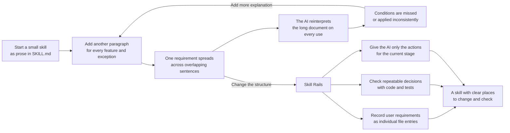

# Skill Rails

English · [한국어](README.ko.md)

Skill Rails does not manage a complex skill as one long prompt. It records requirements item by item, lets code and tests decide repeatable rules mechanically, and gives the AI only the instructions it needs now.

| What goes wrong today | What Skill Rails actually does | What changes immediately |
| --- | --- | --- |
| User requirements scatter across long conversations and many paragraphs. | Record each requirement and link it to where it appears and how it can be checked. | Missing requirements and the places to change become visible. |
| The AI reinterprets even exact, repeatable rules on every use. | Process the same input in code and check the result with tests. | The same rule is applied the same way when the model or session changes. |
| The AI rereads the whole rulebook for every task. | Route P0/P1 to matching judgment topics and calculate the current P2 action. | Prompts can avoid unrelated prose, and key rules are less likely to disappear in long conversations. |

An agent skill usually begins with a `SKILL.md`: a document that tells an AI how to handle a recurring kind of work. That works well while the skill is small. Trouble begins when every missed condition, new exception, and safety rule is added as another paragraph.

The document grows, but its behavior does not become more precise. A later agent may read the same sentence differently, miss a rule buried in the middle, or forget an early requirement after a long conversation. Fixing that miss with more prose often makes the next miss more likely.

Skill Rails takes a different approach. It keeps the parts that genuinely require judgment in short, readable prose and moves rules that should produce the same result from the same input into scripts and tests. For a complex skill whose next action changes with its state, code calculates that flow as well. The result is still one standalone skill, but its rules no longer have to be recovered from one large block of prose.

## The problem, and the way out



Skill Rails breaks the cycle in three steps.

### 1. Write down every user requirement before building the skill

Skill Rails first records the request item by item in `.skill-rails/intent.json`. For example, “never modify the source files” becomes one independent item. A tracking table in `obligation-ledger.json` links that item to where it is implemented and how it can be checked. That check may point to the exact file section containing the rule or to a test that runs it. If either the implementation or the check is missing, the requirement remains unfinished. When another AI continues the work, it can read these files instead of reconstructing the request from an old conversation.

### 2. Put repeatable rules in code and leave judgment in prose

The destination follows from what the rule actually does.

| Example rule | Where the rule goes | What changes |
| --- | --- | --- |
| “The output must contain exactly three fields.” | An output-checking script and an expected-result test | Code checks the field count every time. |
| “If approval is missing, ask before continuing.” | A tested P2 condition that reads approval and returns `ASK` | The next action no longer depends on how the AI rereads the sentence. |
| “Decide whether the explanation is appropriate for this reader.” | Short prose guidance | The AI keeps the judgment that cannot be calculated honestly. |

The rule is simple: **if a machine can check it reliably, do not leave it as prose that the AI must reinterpret.**

### 3. During use, give the AI only the instructions it needs now

For a P0 or P1 skill with independently relevant judgment topics, the entry document first opens a small guidance index. Each row says when one topic applies and points to exactly one file. The AI is instructed to read matching topics and leave unrelated prose on disk. Universal boundaries, exact formats, and stop rules remain in the entry instead of being hidden behind optional routing.

Suppose a P2 skill is waiting for fresh test results. The execution script generated with the skill—the runtime—returns `WAIT`, allows tests to run, forbids release, and requires a fresh test result. Planning and completion rules do not need to enter the AI's context at that moment. All rules remain in files, while the using AI receives only what it may do now and what evidence is still missing.

## A concrete example

Imagine a release-check skill written only as prose:

> Check that tests exist. If they are old, run them again. Do not release without approval. In a read-only environment, do not modify files. Report completion only when there is proof.

This looks clear at first. After several edge cases are added, the important questions become harder to answer: What counts as old? Which rule wins when approval exists but the environment is read-only? What proves that tests actually ran?

With Skill Rails, each sentence is separated into inputs, decision code, and tests:

- the original requirements remain in `intent.json`, while `obligation-ledger.json` records where each one is implemented and how it can be checked;
- test freshness, approval, and read-only status become input values that describe the current state, called observations;
- a condition table maps those input combinations to `BLOCK`, `WAIT`, `ASK`, or `DONE`;
- fixed inputs and expected results, called fixtures, replay every important branch;
- the execution script gives the agent one small result for the current state;
- the actual execution record, or trace, is checked against the required evidence, so an unsupported “done” does not become success.

The agent might receive a result as simple as:

```json
{
  "status": "WAIT",
  "stage": "verification",
  "allowed_actions": ["run-tests"],
  "forbidden_actions": ["release"],
  "proof_required": ["fresh-test-result"]
}
```

If “fresh” later changes from 24 hours to 12, the maintainer changes the one piece of code that defines that threshold and reruns the related tests. There is no need to hunt through several paragraphs and hope every paraphrase was updated.

## P0, P1, and P2 are not levels of rigor

The three profiles describe how a skill enforces its rules, not how strictly it follows them. Every generated skill records the user's requirements in files, gives examples of when the skill should and should not run, and tracks where each requirement appears and how it can be checked. One repeatable, machine-checkable rule moves the skill to at least P1. If the next action depends on the current state or evidence, it moves to P2.

A judgment-only skill with no state changes does not become more accurate when a P2 runtime is added; it only gains more files and code to maintain. The profiles avoid that unnecessary structure without leaving rules unmechanized when code can check them.

| Profile | When to choose it | What gets created | What the using agent does |
| --- | --- | --- | --- |
| **P0 — structured judgment** | Interpretation, critique, or advice is the real work, with no transformation that code can repeat exactly. | A requirements file, explicit boundaries, a requirement tracking table, examples of when to invoke or not invoke the skill, and conditional topic files only when the prose has distinct read conditions. | Reads the entry and only matching judgment topics, then applies judgment. |
| **P1 — executable mechanics** | Some part needs an exact format, input check, or repeatable transformation. | The P0 files plus validation or transformation scripts, templates, rejected-input tests, and expected-result tests. | Loads matching judgment topics and runs code for work that must repeat exactly. |
| **P2 — executable behavior flow** | Approval, evidence, order, or current state changes what may happen next. | The mechanics needed from P1 plus state inputs, stage conditions, an execution script that calculates the next action, execution records, and evidence checks. | Gives the runtime the current facts and follows the returned allowed actions, forbidden actions, and evidence requirements. |

A profile belongs to one skill, not to an entire plugin or repository. A plugin can contain a small P0 brainstorming skill, a P1 formatter, and a P2 implementation workflow side by side. They remain separate skills; Skill Rails does not chain them together.

No later check can recover a user requirement that the authoring AI failed to record. For example, if “never modify the source files” is missing from `.skill-rails/intent.json`, the validation code cannot know that this condition disappeared. Skill Rails therefore separates the request into individual items before creating files, then checks the recorded implementation and verification location for each item. An unclear item stays open for review instead of being quietly discarded.

## What gets created

The exact package stays proportional to the skill.

```text
my-skill/
├─ SKILL.md                    # discovery and the short entry procedure
├─ references/                # a small routing index and conditional judgment topics when needed
├─ scripts/ templates/ tests/ # added when P1 mechanics are needed
├─ spec.mjs                   # P2 conditions and next actions for each state
├─ body.md                    # P2 guidance that still requires AI judgment
├─ fixtures/                  # P2 fixed test inputs and expected results
├─ scripts/skill-rails/       # P2 code that calculates the next action
└─ .skill-rails/
   ├─ intent.json             # what the user originally asked for
   ├─ obligation-ledger.json  # implementation and check location for each requirement
   └─ eval-cases.json         # requests that should trigger the skill and similar ones that should not
```

A new P1 script keeps a marker that says its real helper is not implemented yet. A new P2 package keeps unresolved rules in `review-required` and `DEFERRED`. Until the authoring agent replaces them with real rules and passes the tests, `eval.mjs` does not report the package as ready to release. This prevents an empty skeleton from being reported as a finished skill.

## Context stays proportional too

```text
P0  entry SKILL.md → optional index and matching topic → agent decides
P1  entry SKILL.md → optional topic + validation/transform script → checked result
P2  entry SKILL.md → next-action script ───────────→ current-step instructions
```

P0/P1 routing appears only when the intent declares a stable topic ID, a concise `when` condition, and the judgment points owned by that topic. Plain judgment remains in `SKILL.md`. The profile does not change because document loading and behavioral mechanization are separate decisions. Lint rejects missing indexes, broken topic links, orphaned topic Markdown, duplicated routed prose in the entry, and obligation-ledger drift.

For P2, all behavior rules live in `spec.mjs`, but the AI does not read that entire file every time it uses the skill. The execution script calculates the current stage and next action, then returns a small JSON result called a Decision. It contains only the current status, allowed and forbidden actions, material to read now, and evidence still required.

## Install and use it

From a project with Node.js 22.20 or newer, run the following command. This version requirement comes from the current `skills` installer.

```bash
npx skills@latest add nanomia-ai/skill-rails
```

Choose `skill-rails`, the AI tools you use, and project or global scope. The installer places the same Skill Rails package where each tool discovers skills, such as `.claude/skills/` for Claude Code and `.agents/skills/` for Codex. No separate dependency installation or configuration is required.

If this is the first skill installed while an AI session is already open, restart that session once only if the skill does not appear. This refreshes skill discovery; it is not another installation step.

Then ask the installed Skill Rails skill in ordinary language:

```text
Use Skill Rails to create a release-check skill in ./skills/release-check.
It must stop when test evidence is missing, ask when approval is absent,
and never claim completion without proof.
```

The authoring agent asks a follow-up only when the answer would change what the skill must do, must not do, or produce. It records those answers in files, selects the profile, implements the real rules and tests, and runs the checks. Its final report separates what it actually executed from what still needs to be tried in the real installation environment.

## Run the scripts directly

Most users do not need to run the commands below. Use them only when starting automation from an intent file or checking a generated package in a separate workflow.

To work directly from an intent file, start with [`templates/intent-brief.json`](templates/intent-brief.json). Replace `<skill-rails>` with the installed directory:

```bash
node "<skill-rails>/scripts/init.mjs" --intent ./intent.json --out ./my-skill --profile auto
```

Port an existing prose skill without modifying the source:

```bash
node "<skill-rails>/scripts/migrate.mjs" --source ./old-skill --out ./ported-skill
```

Validate and evaluate the result:

```bash
node "<skill-rails>/scripts/lint.mjs" --skill ./my-skill
node "<skill-rails>/scripts/build.mjs" --skill ./my-skill
node "<skill-rails>/scripts/eval.mjs" --skill ./my-skill
```

## What has been verified

At the `b277a4c` v0.1.2 release baseline, the recorded environment passed code linting and all 49 tests, including a dependency-blocked run of the normal creator commands and parser-backed migration. It also distinguished the expected results in a fixed suite of normal and deliberately broken cases. Earlier compatibility runs on Node.js 20, 22, and 24 each passed the then-current 35-test suite. Fresh project-local sessions created P1 and P2 skills and used the same generated packages through both tested installation layouts. P2 also passed required-file and reference checks (L0–L18), tests that deliberately break rules and expect failure, repeatable state scenarios, and comparisons between execution records and required evidence. A separate fresh author/consumer pair read only the one relevant topic from a five-topic P0 package; multi-match, no-match, near-miss, and large-index routing recall remain unverified.

Those results support the tested Windows project-local path. The GitHub remote package was also installed with `skills` 1.5.23 into Codex, Claude Code, and Cursor targets; its node_modules-free migration preserved the 12 expected semantic atom kinds and its generated P2 passed L0–L18. This proves discovery, copying, and installed command execution, not fresh-agent behavior on every target. Marketplace distribution, Linux/macOS behavior, broad trigger precision, and recovery after real long-session compaction remain unverified.

Run the repository checks with:

```bash
npm ci
npm run verify
```

## Product boundary

Skill Rails creates and maintains one standalone skill at a time. It does not split an entire plugin into skills, call another skill automatically when one finishes, or replace the host agent with a system that manages the execution order of many skills.

The P2 execution script calculates the next action and checks whether evidence exists; it does not perform that action itself. For example, it can allow `run-tests`, but the AI still runs the test command. It is not a security layer and cannot physically stop a forbidden tool call. It can mark unsupported completion as `unproven`, while the host platform remains responsible for actual tool permissions.

## Documentation

- [Product purpose and design boundaries (Korean)](docs/skill-rails_ko.md)
- [Implementation scope and verification record (Korean)](docs/implementation-verification_ko.md)
- [Authoring workflow](references/authoring-workflow.md)
- [P2 contract](references/p2-contract.md)
- [Evaluation method](references/evaluation.md)
