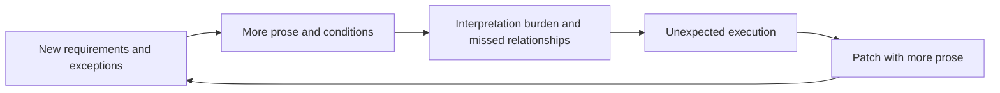
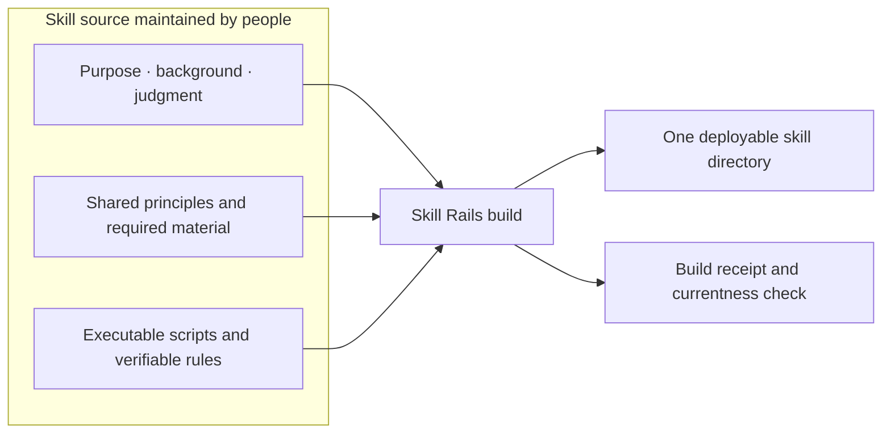

<p align="center">
  
</p>

<br />

<p align="center"><strong>AI skills can be designed, built, and verified like software.</strong></p>

<p align="center">Skill Rails connects purpose and judgment written in natural language with executable scripts and verification,<br />then builds a skill directory that an AI tool can discover and run.</p>

<p align="center">
  
</p>

<p align="right">English · <a href="README.ko.md">한국어</a></p>

## AI skills start as small documents

An AI skill is a collection of instructions and tools that tells an AI how to perform a particular kind of work. When a recurring workflow, decision rule, or output format is captured as a skill, the AI can load it when needed and apply it to the task at hand.

At first, a short `SKILL.md` is often enough. Once the skill is used in real work, however, exceptions, safety constraints, execution order, output formats, and recovery instructions begin to accumulate. Eventually, one document is carrying not only purpose and judgment, but also conditionals, procedures, state checks, and error handling.

As the document grows, the AI must reinterpret more material on every use. The same condition may be read differently in a different context, and a sentence added to prevent one failure may conflict with another rule. Each omission is patched with more prose, making the skill longer and harder to trust with every revision.



Natural language itself is not the problem. The problem is asking a single body of prose to carry both human judgment and execution rules that a machine could repeat.

## Skill Rails turns a skill into something you build

In a conventional skill, the source a person edits and the artifact placed in an AI tool's skill path are effectively the same document. That is similar to editing a finished program in place. Small changes are easy, but as the skill grows, it becomes harder to tell what the source is and which artifact is current.

Skill Rails separates the **skill source** maintained by people from the **build artifact** used by the AI.

The source keeps the purpose, background, judgment criteria, and exceptions in the author's own language. Principles shared by several skills have one source owner. Conditions, formats, input state, and record safety that must be handled the same way every time can move into Node.js scripts and verifiable rules.

Skill Rails reads that source and builds one skill directory for an AI tool to use. Rebuilding the same source produces the same artifact. Integrity and source currentness are checked separately, so you can tell whether a deployed artifact was modified and whether it became stale after its source changed.



### What does a build actually produce?

The result is not a separate application or server. It is a directory in the normal AI skill format. Some folders are optional, but a built skill generally looks like this:

```text
my-skill/
├─ SKILL.md                  # The entry document the AI reads first
├─ references/               # Reference material included for this skill
├─ scripts/                  # Execution logic and integrity tools
├─ config/                   # The target declaration
└─ .skill-rails-build.json   # A receipt identifying the source of the build
```

Copy this directory—or place it with a standard skill installer—under a project path such as `.agents/skills/my-skill/` or `.claude/skills/my-skill/`. The AI tool discovers `SKILL.md` and can use the material and scripts bundled with it.

This is what *standalone* means here. It does not mean that another program is installed. **The skill directory contains everything it needs at runtime, so it does not have to reach back into the source directory or a Skill Rails installation.**

The goal is not to restrain the AI with a longer prompt. It is to **state meaning more clearly where the AI must judge, and turn work that must repeat the same way into scripts the AI can execute.**

## What does “mechanizing” a skill actually mean?

Suppose you want a skill that turns meeting notes into a useful follow-up summary:

> Separate decisions, owners, due dates, and unresolved items. Do not invent facts that are absent from the notes. Organize the result in a consistent format.

A person can understand the intent. Execution introduces harder questions: Which statements were actual decisions rather than proposals? How much can be inferred about an owner or due date? Should an ambiguous statement remain unresolved? Is it safe to overwrite an existing summary? Listing every case in prose forces the AI to reinterpret the rule each time.

A natural-language instruction is not the execution itself. Even if it says, “check every input, repeat the same validation when conditions A and B hold, and do not write a result after a failure,” the AI may omit a condition or apply the steps in a different order. More branches and repetitions require more prose to guard against more interpretations.

A Skill Rails skill can divide those responsibilities:

| Judgment left to natural language and the AI | Execution a script can own |
| --- | --- |
| Which statements were actually decided? | Do the declared meeting notes exist? |
| Can an owner or due date be established from context? | Did the input change after summarization began? |
| Should an uncertain statement remain unresolved? | Does the result contain the required fields and format? |
| What should be asked of the user? | Would the write conflict with an existing result? |
| Does the summary preserve the meaning of the meeting? | Does rereading the written result produce the expected content? |

Scripts do not imitate the AI's judgment. They verify facts that can be calculated reliably: files, hashes, formats, and declared inputs and outputs. The AI interprets those facts and returns to the user when meaning or authority is missing.

A condition that would take several sentences in prose can become an `if` statement. A procedure repeated for every input can become a loop. A transformation that must behave the same way in several places can become a function. The skill document only needs to say when to run the script and how to interpret its result.

As the mechanically handled portion grows, **the amount of prompt text required by the skill can shrink.** Nothing is being omitted: execution rules are moving from prose that must be interpreted into code that is actually run. This does not guarantee that the AI will always invoke the script correctly, but once invoked, its conditions, loops, and format checks are no longer reinterpreted on each run.

Scripts can also be tested like ordinary code. When something fails, you can fix the faulty condition or output logic instead of rewriting the entire body of prose. Execution logic moved into code is easier to repeat and its results are more trustworthy than logic carried only by natural-language instructions.

## Write in your own language, then structure it with AI

You do not need to begin with a complex configuration file. Start by describing the skill you want in ordinary language.

- What work is being repeated because this skill does not exist?
- What purpose and background must the AI understand?
- Which parts require contextual judgment by a person or the AI?
- Which parts should always be checked or produced the same way?
- What must be observed before the work can honestly be called complete?

The AI uses those answers to structure the skill source. It separates the entry document that every run needs, shared sources used by multiple skills, and targets that will be built independently. If a meaningful decision is missing, it should remain undecided or return to the user rather than being filled with plausible prose.

```text
my-skill-source/
├─ skill-package.json
├─ modules/
│  └─ shared-policy.md
└─ targets/
   ├─ plan/
   │  ├─ target.json
   │  └─ entry.md
   └─ verify/
      ├─ target.json
      └─ entry.md
```

This structure is not a template that replaces the user's language with prescribed wording. The concepts and expressions created by the author remain in the source. The structure makes it explicit where each meaning lives and which skills consume it.

## Build several standalone skills from one source

Imagine that a planning skill and a verification skill use the same policy. Copying that policy into both `SKILL.md` files is convenient at first. When the policy changes, both copies must be found and edited. Missing one does not prevent installation or execution, so an outdated rule can remain silently active.

With Skill Rails, the policy has one source owner and both targets declare that they consume it. At build time, each skill receives the material it needs. The planning and verification skills can then be placed and used independently without depending on each other.

When the shared policy changes, existing artifacts remain intact but become *stale relative to their source*. You can identify the affected targets and rebuild only the skills that need to change.

This matters more as a skill system grows:

- Authors change one owner for one meaning.
- Maintainers can move directly from a changed source to the skills that consume it.
- The AI using a generated skill does not need the authoring repository or Skill Rails internals.
- Each generated skill runs without another skill or a global Skill Rails runtime.

## What changes when you use Skill Rails?

| When a skill is managed as prose alone | When the skill is built with Skill Rails |
| --- | --- |
| You edit the `SKILL.md` that will be deployed. | You edit maintained source and rebuild the artifact. |
| Branches, loops, and shared processing are all explained in sentences. | They move into `if` statements, loops, and functions; the document keeps their meaning and invocation rules. |
| The same rule is copied into several skills. | One shared source feeds several build targets. |
| Change impact is traced by opening files one by one. | Declared relationships connect sources to their consumers. |
| Currentness is checked by visually comparing installed files. | Artifact integrity and source currentness are checked separately. |
| A successful build can be mistaken for successful AI behavior. | Delivery checks and real-use observations remain separate evidence. |

Authors can focus on explaining the problem in their own language, while AI helps organize that material into the recommended structure. The AI using the result receives only the built skill; it does not have to relearn how the skill was authored or how Skill Rails itself works.

## Mechanize only as much as the skill needs

Not every skill needs a script. If an AI can understand the purpose and judgment criteria and then act with files, a terminal, or a browser, a natural-language-centered skill is often the better design. Skill Rails starts with this simplest form.

When a single declared output must be recorded repeatedly, and input changes, concurrent edits, exact formatting, or reread verification are real risks, only that portion needs to move into a script. Skill Rails calls this optional recording structure `record-only`.

Do not split a document merely because it is long, or mechanize a rule merely because it can be expressed in code. Separate only material that a real task can safely skip, and only when the reading saved is greater than the cost of finding and rereading it.

## Rails do not help when the destination is wrong

Skill Rails does not choose the destination for a skill. If an unclear purpose or missing judgment is built into a precise structure, the wrong skill will simply be produced more consistently.

Skill Rails can still fail when you:

- Fill in file formats before defining purpose and completion.
- Freeze human judgment and permission decisions into code too early.
- Split material that must be read and judged together.
- Edit a generated artifact and allow it to diverge from its source.
- Treat a passing structural check as proof that an AI understood and followed the skill.
- Keep adding rules, state, and checks in an attempt to eliminate every uncertainty.

The better approach is the reverse: begin with the smallest natural-language skill, then move only observed interpretation gaps and execution risks into scripts. Build checks establish that the artifact was delivered correctly. A fresh AI using the skill establishes whether it was actually understood and produced the intended effect.

## Install and get started

Skill Rails currently runs on Node.js `24.x`. Install it with:

```bash
npx skills@latest add nanomia-ai/skill-rails
```

This step installs `skill-rails`, the authoring skill—not the skill you intend to create. You will then use it to create a separate skill source and its build artifacts.

During installation, select `skill-rails`, the AI tools that should receive it, and either a global or project location. Restart the AI tool only if the installed `skill-rails` does not appear in the current session.

Then describe the skill you want in ordinary language:

```text
Use Skill Rails to create a skill that organizes meeting notes.

It should separate decisions, owners, due dates, and unresolved items.
Keep judgments about what was actually decided and how to handle uncertainty in natural language.
Turn only repeatable checks for missing fields and a consistent output format into scripts.
Separate the maintained source from the skill directory the AI tool will use, then build and verify it.
```

The AI identifies the purpose and boundaries, writes the required sources and targets, and builds the skill. From then on, edit the source and rebuild rather than changing the artifact directly.

### When you need the commands directly

Let `<skill-root>` be the directory containing the installed `SKILL.md`. The current command forms are available through:

```bash
node "<skill-root>/scripts/skill-rails-cli/src/core/cli.mjs" --help
```

- `build` builds one target or every target.
- `check` verifies artifact integrity and source currentness.
- `inspect` finds an exact source and the targets that consume it.
- `overview` calculates a human-readable view of the current source graph.

`overview` is a view for understanding the current structure, not another source document that must be maintained.

## What has been verified

Skill Rails has been exercised with deterministic rebuilds from the same source, separate integrity and source-currentness checks, multiple targets consuming one shared source, and affected-only rebuilds. Installed Skill Rails was also used to author and build multiple skills, after which separate Codex and Claude Code sessions used the generated skills to produce real outputs.

That does not establish the same cost reduction or quality improvement for every skill and environment. Structural and build checks establish delivery. Real-use observations establish AI behavior and effects. Effects that have not been observed remain unproven.

## Product boundaries

Skill Rails is an authoring system for creating and maintaining standalone AI skills. It does not orchestrate work across repositories or control an AI's permissions.

One source package may contain several build targets, but every generated skill must remain usable on its own. At runtime, it does not depend on this repository, another skill, or a global Skill Rails installation.

## Documentation

- [Skill Rails usage procedure](skills/skill-rails/SKILL.md)
- [Product purpose and architecture (Korean)](docs/skill-rails_ko.md)
- [Implementation and verification scope (Korean)](docs/implementation-verification_ko.md)
- [Method for evolving AI skills (Korean)](docs/guide/ai-skill-evolution-method_ko.md)
