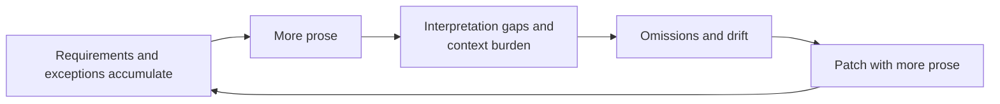
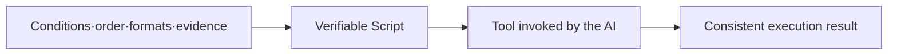
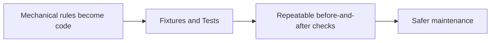
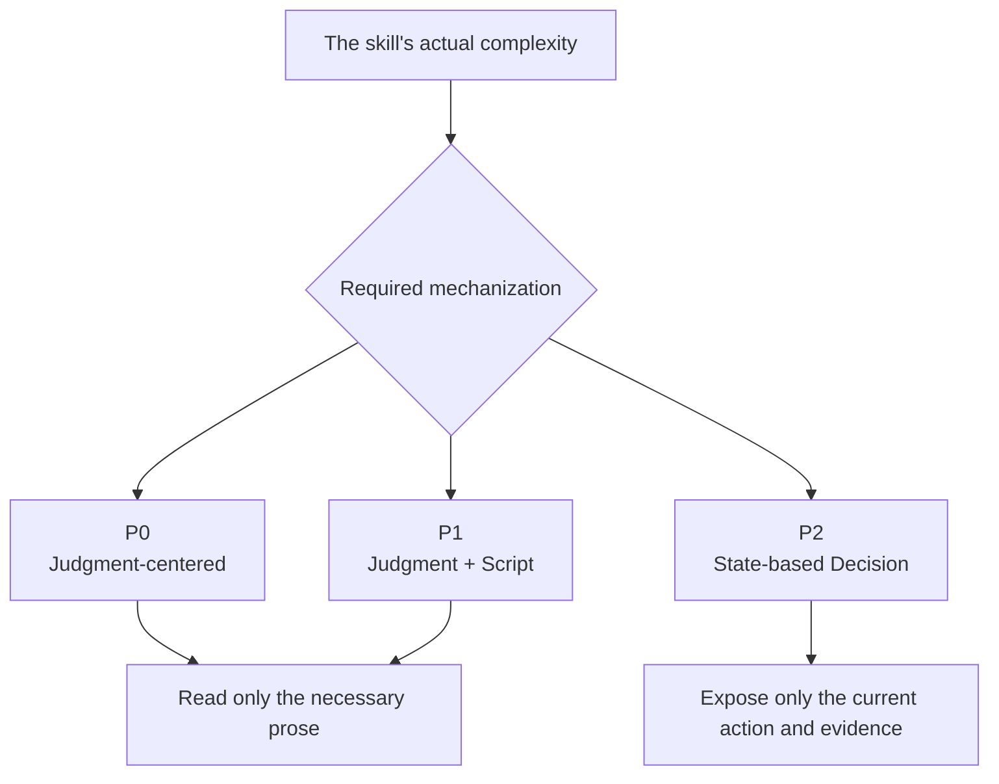
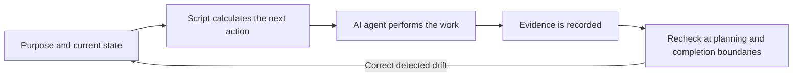
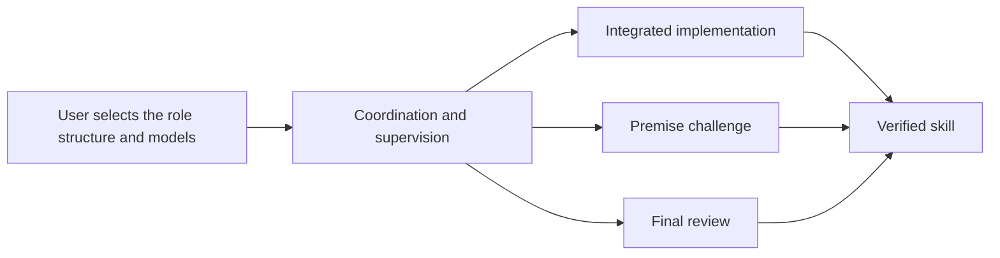

<h1 align="center">SkillRails</h1>

<p align="center"><strong>Solves most of the problems that arise when developing Skills with AI agents.</strong></p>

---

<p align="right">English · <a href="README.ko.md">한국어</a></p>

## Problems that arise while developing skills

- Implementing complex behavior with text-based Skills is hell.
- Refining prose that can be read differently depending on perspective with AI agents risks falling into a dirty, endless loop of prose rewrites.
- As requirements accumulate over time, skills grow longer, and making an agent reread everything each time becomes burdensome.
- Skills written in prose are difficult to validate for consistency.
- Logic written in prose is easy for AI agents to drift from, and there is no guarantee that it will be executed as intended.



## How Skill Rails solves them

### 1. How do you implement complex logic in Skills?

The longer a prose prompt becomes, the more likely an AI agent is to drift. Skill Rails moves mechanically decidable conditions, order, formats, and evidence requirements into code, then connects the resulting scripts as tools for the skill. Instead of reinterpreting long prose on every invocation, the AI can execute the same logic repeatedly.



### 2. Does skill implementation and maintenance really become easier?

- Implementing conditions and execution logic in prose that different readers may interpret differently is extremely difficult. It creates many variables and makes the result unstable. Moving the mechanical parts into code lets you separate and solve the problem through ordinary software development practices, making the implementation process more orderly.
- Once mechanical processing becomes a script, fixtures and tests are easier to attach. You can compare results repeatedly before and after a change and verify that the intended rules still hold, making the result more trustworthy.



### 3. Can every part of a skill be turned into code?

- AI agents read text to obtain the purpose, background, and criteria needed for active judgment. Skill Rails does not replace that judgment. It gives the AI agent scripts containing the major execution logic as tools it can use.
- Judgment that cannot honestly be fixed in code remains in prose. Material needed only in different situations is split into a tree linked from `SKILL.md`, so the AI agent reads only the information needed for its current task.
- Skill Rails selects the smallest sufficient profile from P0 through P2 according to the skill's complexity. These numbers are not quality or rigor grades. P0 is judgment-centered, P1 combines judgment with scripts, and P2 calculates the next action and required evidence from the current state. A higher profile is used only when more mechanization is genuinely necessary.



### 4. What changes when you develop and use a skill with Skill Rails?

- The AI agent reads only what the current situation requires, optimizing its context use.
- Mechanically decidable execution logic runs through tested scripts, making the result more trustworthy than relying on prose interpretation alone.
- During the work, scripts recalculate allowed actions, required evidence, and the next step so drift can be corrected mechanically. Before approving a substantive plan and before declaring implementation complete, the agent rereads the original purpose and the relevant Skill Rails guidance, then counterchecks the whole plan or result for drift.



This structure does not guarantee that AI drift will never occur. It creates a path that is harder to drift from and improves the chance of detecting and correcting departures at meaningful completion boundaries.

### 5. What else does Skill Rails provide?

- Skill Rails includes guidelines for preventing recurring problems in skill development and a harness derived from real failure cases. This harness is not an answer key that grows through endless exceptions. It gives the AI judgment criteria for understanding the purpose and background and reaching a fundamental, natural solution.
- When work benefits from separated roles, you can start with a concise default: overall coordination and supervision, integrated implementation, premise challenge and cross-checking, and final whole-result review. Roles are not forced automatically, and an agent does not claim one for itself. They activate only when a user or an authorized delegating agent explicitly assigns them. A user's different structure or model assignment takes precedence.
- In an orchestration environment, these roles can be assigned to separate agents. Without such an environment, the primary agent retains the long-running implementation, while subagents can handle bounded work such as independent premise challenges and final reviews.
- When invoking another agent, the caller passes more than the requested task. It also carries the original purpose, background, intent behind the instruction, values that must remain intact, and the desired end direction. If that agent delegates again, the same intent-bearing core continues downstream.



## Installation

Run the following command in an environment with Node.js 22.20 or later.

```bash
npx skills@latest add nanomia-ai/skill-rails
```

Select `skill-rails`, the AI tools you use, and either a global or project installation. The installer places a standalone Skill Rails package under `.claude/skills/` or `.agents/skills/`, depending on the selected environment.

Restart the AI tool only if the newly installed skill does not appear in the current session.

### Use it immediately after installation

Once installation is complete, ask the AI agent in ordinary language.

```text
Use Skill Rails to create a release-check skill in ./skills/release-check.
Stop when fresh test evidence is unavailable, ask when approval is missing,
and do not treat the work as complete without evidence.
```

Skill Rails organizes the requirements into traceable obligations, selects the necessary degree of mechanization, and creates the skill package together with its verification structure.

### Run the scripts directly

Most users do not need to run the commands below. Use them only when starting automation from an intent file or checking a generated package in a separate workflow.

To start directly from an intent file, use the [intent brief template](skills/skill-rails/templates/intent-brief.json). Replace `<skill-rails>` below with the installed path.

```bash
node "<skill-rails>/scripts/init.mjs" --intent ./intent.json --out ./my-skill --profile auto
```

Port an existing prose skill without modifying the source.

```bash
node "<skill-rails>/scripts/migrate.mjs" --source ./old-skill --out ./ported-skill
```

Validate and evaluate the generated result.

```bash
node "<skill-rails>/scripts/lint.mjs" --skill ./my-skill
node "<skill-rails>/scripts/build.mjs" --skill ./my-skill
node "<skill-rails>/scripts/eval.mjs" --skill ./my-skill
```

## Product boundaries

Skill Rails is an authoring system for creating and maintaining one skill at a time. It is not a system for orchestrating an entire repository or multiple skills.

The P2 runtime calculates and validates allowed actions, required evidence, and the next Decision from the current state. It does not perform the domain work itself or control the host tool's permissions.

## Documentation

- [Skill Rails usage procedure](skills/skill-rails/SKILL.md)
- [Product purpose and structure (Korean)](docs/skill-rails_ko.md)
- [Implementation and verification scope (Korean)](docs/implementation-verification_ko.md)
- [Lessons from authoring skills (Korean)](docs/authoring-lessons_ko.md)
