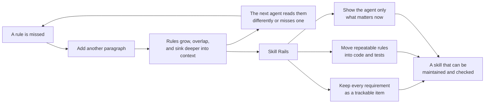

# Skill Rails

English · [한국어](README.ko.md)

Turn a growing skill from a pile of instructions into a system an AI can maintain and follow.

An agent skill usually begins with a `SKILL.md`: a document that tells an AI how to handle a recurring kind of work. That works well while the skill is small. Trouble begins when every missed condition, new exception, and safety rule is added as another paragraph.

The document grows, but its behavior does not become more precise. A later agent may read the same sentence differently, miss a rule buried in the middle, or forget an early requirement after a long conversation. Fixing that miss with more prose often makes the next miss more likely.

Skill Rails takes a different approach. It keeps the parts that genuinely require judgment in short, readable prose, but moves anything that can be repeated or checked exactly into scripts, tests, or an executable behavior specification. The result is still a normal, standalone skill—just no longer one undifferentiated block of text.

## The problem, and the way out



Skill Rails breaks the cycle in three steps.

### 1. Remember the design outside the conversation

Before generating files, it records the original problem, intended uses, requests that should not trigger the skill, inputs, outputs, safety boundaries, and completion evidence. Each requirement becomes a trackable item in an obligation ledger: where was it implemented, and which test or evaluation checks it?

This matters when another AI continues the work. It can read the design from disk instead of guessing what an earlier conversation meant.

### 2. Give each rule the right owner

Every rule is examined with three practical questions.

| Question | Where the rule belongs | Why |
| --- | --- | --- |
| Can the same input always be checked or transformed the same way? | A helper, validator, template, and test | The AI should run it, not reinterpret it every time. |
| Does the next action depend on state, approval, order, or evidence? | A P2 behavior spec and runtime | The current branch can be calculated instead of rediscovered in prose. |
| Does the answer depend on context, trade-offs, or human meaning? | A short, addressable prose section | Pretending judgment is deterministic would make the system confidently wrong. |

This is the core rule: **mechanize everything that can be mechanized truthfully, and keep only real judgment in prose.**

### 3. Give the using agent a small current view

Authoring records, tests, and the full behavior model remain available for maintenance, but they do not all enter the model's context during normal use. A simple skill stays short. A deterministic skill runs its helper. A stateful skill asks its runtime for the current decision and loads only the guidance and template needed for that decision.

## A concrete example

Imagine a release-check skill written only as prose:

> Check that tests exist. If they are old, run them again. Do not release without approval. In a read-only environment, do not modify files. Report completion only when there is proof.

This looks clear at first. After several edge cases are added, the important questions become harder to answer: What counts as old? Which rule wins when approval exists but the environment is read-only? What proves that tests actually ran?

With Skill Rails, the same intent is separated into things that can be checked:

- the original requirements remain in the intent and obligation ledger;
- test freshness, approval, and read-only status become named inputs called observations;
- a P2 table maps those observations to `BLOCK`, `WAIT`, `ASK`, or `DONE`;
- fixed test cases, called fixtures, replay every important branch;
- the runtime gives the agent one small result for the current state;
- an execution trace is compared with the required evidence, so an unsupported “done” does not become success.

The agent might receive a result as simple as:

```json
{
  "status": "WAIT",
  "stage": "verification",
  "allowed_actions": ["run-tests"],
  "forbidden_actions": ["release"],
  "proof_required": ["fresh-test-result"]
}
```

If “fresh” later changes from 24 hours to 12, the maintainer changes the rule at its stable address and reruns the affected fixtures. There is no need to hunt through several paragraphs and hope every paraphrase was updated.

## P0, P1, and P2 do not reduce rigor

The profiles are not permission to leave machine-checkable rules in prose. Every generated skill starts with structured intent, trigger and near-miss cases, an obligation ledger, and an evaluation surface. If a repeatable rule appears, the skill moves to at least P1. If behavior depends on state or evidence, it moves to P2.

The profile only prevents a state machine from being added where it would create complexity without adding truth.

| Profile | What kind of skill is it? | What Skill Rails adds | What the using agent does |
| --- | --- | --- | --- |
| **P0 — structured judgment** | The useful work is interpretation, critique, or advice, and there is no exact transform to execute. | Durable intent, explicit boundaries, tracked requirements, trigger and near-miss cases, and fresh-agent test cases. | Reads concise guidance and applies judgment. |
| **P1 — executable mechanics** | Part of the work has an exact format, validation rule, or repeatable transformation. | The same authoring record as P0, plus helpers, templates, rejection rules, and expected-output tests. | Uses judgment where needed, but delegates exact work to code. |
| **P2 — executable behavior flow** | The correct action changes with state, approval, evidence, order, or an irreversible boundary. | The same authoring record and exact mechanics where needed, plus named facts, entry conditions, stages, condition tables, replayable cases, execution records, and evidence checks. | Calls the runtime and follows the current Decision instead of rereading the whole rulebook. |

A profile belongs to one skill, not to an entire plugin or repository. A plugin can contain a small P0 brainstorming skill, a P1 formatter, and a P2 implementation workflow side by side. They remain separate skills; Skill Rails does not chain them together.

Suppose the user says, “Never modify the source files,” but the authoring agent forgets to carry that condition into the intent and obligation ledger. The validator and runtime cannot check a rule that is absent from the design. Skill Rails therefore breaks the request into individual requirements first, then checks where each one was implemented and tested. If a requirement is unclear, it stays open for review instead of being quietly discarded.

## What gets created

The exact package stays proportional to the skill.

```text
my-skill/
├─ SKILL.md                    # discovery and the short entry procedure
├─ references/                # judgment and knowledge, loaded when needed
├─ scripts/ templates/ tests/ # added when P1 mechanics are needed
├─ spec.mjs body.md fixtures/ # added when P2 behavior flow is needed
├─ scripts/skill-rails/       # self-contained P2 runtime
└─ .skill-rails/
   ├─ intent.json             # what the user originally asked for
   ├─ obligation-ledger.json  # where each requirement went
   └─ eval-cases.json         # positive and near-miss behavior cases
```

P1 and P2 begin as fail-closed scaffolds. They are not finished until the authoring agent replaces generic markers with the real domain rules and proves them with tests.

## Context stays proportional too

```text
P0  concise SKILL.md ───────────────────────────────→ agent judgment
P1  concise SKILL.md → deterministic helper ───────→ exact result
P2  thin SKILL.md → runtime → current Decision ────→ current guidance only
```

For P2, `spec.mjs` is the behavior source, but the model does not need to read the entire file during ordinary use. The runtime validates it, calculates the current stage, and returns a compact Decision: current status, allowed and forbidden actions, material to load, and proof still required.

## Current platform support

The authoring model is not tied to one agent product. An adapter is the thin platform-specific layer that tells an agent where to discover the skill, how to resolve its installed path, and which metadata it needs. The adapter does not own the behavior contract, so adding another platform should not require a second copy of the skill's rules.

The adapters currently implemented and tested are:

- **Codex:** project-local discovery from `.agents/skills`;
- **Claude Code:** project-local discovery from `.claude/skills`.

The same generated package was used across both adapters without maintaining two behavior files.

### Install the current Codex adapter

```bash
git clone https://github.com/nanomia-ai/skill-rails.git .agents/skills/skill-rails
npm --prefix .agents/skills/skill-rails ci
```

### Install the current Claude Code adapter

```bash
git clone https://github.com/nanomia-ai/skill-rails.git .claude/skills/skill-rails
npm --prefix .claude/skills/skill-rails ci
```

Requirements are Node.js 20 or newer and Git. Project-local installation on Windows is the path verified by the current evidence.

## Create your first skill

Ask the installed Skill Rails skill in ordinary language:

```text
Use Skill Rails to create a release-check skill in ./skills/release-check.
It must stop when test evidence is missing, ask when approval is absent,
and never claim completion without proof.
```

The authoring agent should clarify only decisions that change the product boundary, then record the answers on disk, select the profile, implement the real behavior, run the checks, and separate verified facts from what still needs a forward test.

To work directly from an intent file, start with [`templates/intent-brief.json`](templates/intent-brief.json). Replace `<skill-rails>` with the installed directory:

```bash
node "<skill-rails>/scripts/init.mjs" --intent ./intent.json --out ./my-skill --profile auto
```

Port an existing prose skill without modifying the source:

```bash
node "<skill-rails>/scripts/migrate.mjs" --source ./old-skill --out ./ported-skill
```

Validate and evaluate the result:

```bash
node "<skill-rails>/scripts/lint.mjs" --skill ./my-skill
node "<skill-rails>/scripts/build.mjs" --skill ./my-skill
node "<skill-rails>/scripts/eval.mjs" --skill ./my-skill
```

## What has been verified

The repository currently passes its lint, 35/35 tests, and frozen evaluation gate. Compatibility runs passed on Node.js 20, 22, and 24. Fresh project-local sessions created a P1 skill and a P2 skill, then used each generated package through the other current adapter. P2 also passed its L0–L18 validators, mutation checks, deterministic scenario replay, trace, and evidence alignment tests.

Those results support the tested Windows project-local path. They do not yet prove global installation, marketplace distribution, Linux/macOS behavior, broad trigger precision, or recovery after real long-session compaction.

Run the repository checks with:

```bash
npm ci
npm run verify
```

## Product boundary

Skill Rails creates and maintains one standalone skill at a time. It does not automatically decompose a whole plugin, chain skills together, or replace the host agent with a general orchestration runtime.

The P2 runtime computes decisions and checks evidence; it does not perform the domain work itself. It is also not a security sandbox or a physical tool-call interceptor. It can make an unsupported completion visible as `unproven`, while actual tool permissions remain the host's responsibility.

## Documentation

- [Complete design, operation, and verification reference (Korean)](docs/skill-rails_ko.md)
- [Authoring workflow](references/authoring-workflow.md)
- [P2 contract](references/v5-contract.md)
- [Evaluation method](references/evaluation.md)
- [Current platform adapters](references/platform-adapters.md)
