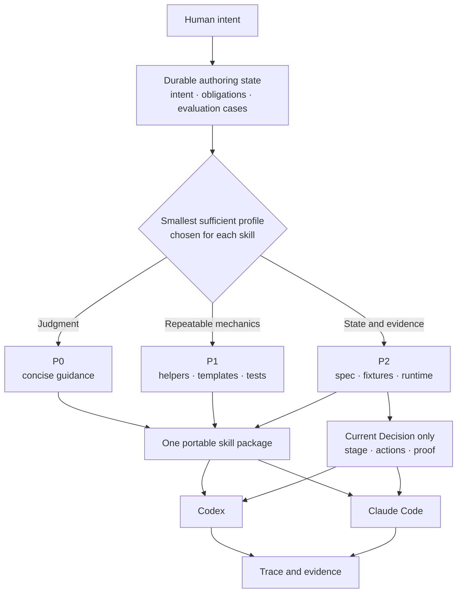

# Skill Rails

English · [한국어](README.ko.md)

Build AI skills that stay understandable as they grow.

Skill Rails turns intent into a durable, verifiable skill package for Codex and Claude Code. It keeps judgment in readable guidance, moves repeatable mechanics into code, and gives stateful skills a compact decision surface instead of another wall of prose.

## Why it exists

A small skill can live comfortably in one `SKILL.md`. Large skills tend to age differently:

- every failure adds another paragraph;
- related rules drift apart or start to contradict each other;
- a long authoring session drops an early requirement;
- the consuming model has to search a growing document for the one rule that matters now;
- “done” becomes a claim with no durable proof behind it.

Skill Rails treats those as design problems, not prompt-polishing problems.



A profile belongs to one skill, not to an entire plugin or repository. A plugin can contain a short P0 brainstorming skill next to a stateful P2 implementation skill. Skill Rails does not chain them together.

## What changes in practice

### Authoring survives the conversation

The user's intent, near misses, boundaries, completion evidence, and unresolved obligations live on disk. A new agent can resume from those artifacts instead of reconstructing the design from chat history.

### Mechanical rules get one owner

Exact transforms, validators, formats, and repeated checks move to helpers and tests. Stateful branches, evidence gates, ordered effects, and terminal outcomes move to a P2 `spec.mjs`. Judgment and rationale stay in prose.

### The consuming agent sees less

P0 stays short. P1 runs a helper without loading its source into context. P2 runs the packaged runtime, which calculates the current stage and returns a compact Decision with only the relevant guidance, actions, restrictions, and proof requirements.

### Missing proof stays missing

Structural validation, model behavior, and task-output quality are separate claims. A report without independent evidence remains `unproven`; the runtime does not silently turn it into success.

## Choose the smallest sufficient profile

| Profile | Use it when | What becomes mechanical | What the agent uses at runtime |
| --- | --- | --- | --- |
| **P0** | The skill is mostly judgment and concise guidance | Intent structure, obligation tracking, trigger and near-miss cases | A short `SKILL.md` and optional references |
| **P1** | Exact transforms, validation, templates, or repeatable helpers matter, but no state machine is needed | P0 plus helpers, formats, golden tests, and deterministic rejection | The guidance and the helper's result |
| **P2** | Behavior depends on state, approval, evidence, ordered effects, or irreversible boundaries | P1 plus observations, guards, stages, tables, Decisions, traces, and alignment | A thin loader and the current Decision—not the whole spec |

Long prose alone does not make a skill P2. Repeated state-dependent behavior does. If one skill contains both simple and stateful paths, the package is P2, while the runtime still exposes only the current path.

## Quick start

### Requirements

- Node.js 20 or newer
- Git
- Codex or Claude Code

### Install for Codex in the current project

```bash
git clone https://github.com/nanomia-ai/skill-rails.git .agents/skills/skill-rails
npm --prefix .agents/skills/skill-rails ci
```

### Install for Claude Code in the current project

```bash
git clone https://github.com/nanomia-ai/skill-rails.git .claude/skills/skill-rails
npm --prefix .claude/skills/skill-rails ci
```

Project-local installation is the currently verified path. The same generated skill package can be copied between Codex and Claude Code without maintaining separate behavior files.

### Ask the agent to create a skill

```text
Use Skill Rails to create a release-check skill in ./skills/release-check.
It must block when test evidence is missing, ask when approval is absent,
and never claim completion without proof.
```

The agent captures the intent, selects P0/P1/P2, creates evaluation cases and an obligation ledger, builds the package, and reports what is verified versus still unproven.

P1 and P2 generation starts fail-closed. The scaffold is not a finished skill until its markers, unresolved obligations, domain behavior, and tests have been replaced with approved project-specific content.

## Direct commands

Start from [`templates/intent-brief.json`](templates/intent-brief.json). Replace `<skill-rails>` below with the installed Skill Rails directory, then run:

```bash
node "<skill-rails>/scripts/init.mjs" --intent ./intent.json --out ./my-skill --profile auto
```

Migrate an existing prose skill without changing the source:

```bash
node "<skill-rails>/scripts/migrate.mjs" --source ./old-skill --out ./ported-skill
```

Validate and evaluate a generated skill:

```bash
node "<skill-rails>/scripts/lint.mjs" --skill ./my-skill
node "<skill-rails>/scripts/build.mjs" --skill ./my-skill
node "<skill-rails>/scripts/eval.mjs" --skill ./my-skill
```

P2 maintenance addresses stable IDs and reports semantic impact:

```bash
node "<skill-rails>/scripts/maintain.mjs" --skill ./my-skill --change ./change.json
```

## Inside a P2 run

```text
thin SKILL.md
    ↓
validated spec + current observations
    ↓
Decision { status, stage, allowed, forbidden, load, proof }
    ↓
current body and template only
    ↓
agent effects → trace → alignment
```

The runtime computes and checks decisions. It does not perform domain effects and it is not a tool-call sandbox. This boundary is deliberate: Skill Rails can make behavior auditable and fail closed on missing evidence, but the host remains responsible for enforcing tool access.

## Verification status

The repository currently passes:

- creator lint, tests, and frozen evaluation gate;
- 35/35 repository tests on the current version;
- compatibility runs on Node.js 20, 22, and 24;
- cold project-local creation with Codex and Claude Code;
- cross-platform consumption of a Claude-created P1 skill and a Codex-created P2 skill;
- P2 validation levels L0–L18, mutation checks, deterministic scenario replay, trace, and evidence alignment.

The evidence supports the tested Windows project-local path. Global installation, plugin-marketplace distribution, Linux/macOS behavior, broad trigger statistics, and long-session compaction recovery are not yet claimed as verified.

Run the repository suite locally with:

```bash
npm ci
npm run verify
```

## Scope

Skill Rails is:

- a creator for one standalone skill at a time;
- a maintenance surface with durable intent and provenance;
- a deterministic build and validation tool;
- a self-contained runtime for P2 skills;
- a portable core shared by Codex and Claude Code.

It is not:

- a skill-to-skill chaining system;
- a plugin-wide automatic decomposer;
- a general orchestration platform;
- a security sandbox or tool-call interceptor;
- proof that every model will follow every instruction.

## Documentation

- [Complete design, operation, and verification reference (Korean)](docs/skill-rails_ko.md)
- [Authoring workflow](references/authoring-workflow.md)
- [P2 contract](references/v5-contract.md)
- [Evaluation method](references/evaluation.md)
- [Codex and Claude Code adapters](references/platform-adapters.md)
